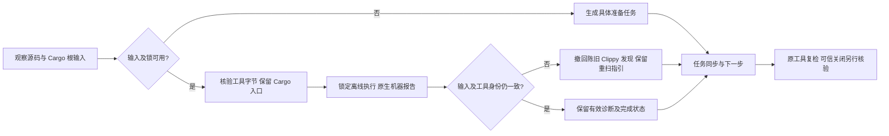

# Cargo 输入稳定性与代理入口验收

对应唯一 OpenSpec change `introduce-rust-codeguard-cli` 的 native-tool-adapters、verdict-integrity、3.7、7.1、9.7/9.10。这里只验收已观察输入的 Clippy 诊断绑定及 Cargo 代理调用，不声明全语言、完整 Cargo 模型、可信关闭或发布完成。

## 问题与修复

旧 Clippy 在执行后读取源码并生成指纹，只复核 Cargo.toml，可能将旧诊断绑定到新源码；配置、锁、工具变化也可能被当作局部完整观察。现用启动前 `SourceSnapshot` 的原始字节绑定 finding，运行后核对根目录身份、已观察源码及根配置的字节/不存在状态和解析后的工具目标/字节。改变时撤回本轮 Clippy findings、保留阻塞，不能据零诊断认定修复。

显式源码最多10,000文件、每文件16 MiB、总64 MiB；可选根文件包含 Cargo.lock、clippy.toml、.clippy.toml、rust-toolchain、rust-toolchain.toml、.cargo/config、.cargo/config.toml。读取拒绝链接父目录。缺源码或有界普通输入不可读时不启动原生进程。

真实 Cargo 暴露了两项额外问题：

- `--offline` 仍可重写既有锁。普通 Clippy 和同规则 `--force-warn` 对照改用 `--locked --offline`；缺根锁在启动前返回 `cargo_lock_unavailable`，不由检查器生成锁。持久环境任务、JSON 简报与 Markdown 指向恢复原 Cargo.lock 或按项目流程准备锁，复检命令保持锁定。
- rustdoc/build 原先直接执行解析后的 `rustup`，失去 Cargo 的入口名称分派。现在保留所选 Cargo 路径执行，同时对解析目标字节做核验；运行后改指另一个同字节目标也保持未完成。

同时间戳的 Clippy scratch 加独立序号且独占创建，防止隔离目录碰撞。稳定输入中先出现有效诊断、后出现坏机器流时仍保留已归属 finding；与输入变化撤回诊断是不同情况。取消与输入变化同时发生时 `request_cancelled` 优先，不把取消降级为普通未完成。



## RED 与真实执行记录

源码/配置/工具变化三项 RED、固定时间戳 scratch RED、锁定 argv 与缺锁两个 RED、缺锁任务指引 RED、代理入口两项 RED、取消加输入变化 RED 均先复现再实现。首次代理夹具把工具链接放在被检查项目内，因发现范围阻塞失败，已改到独立工具目录再复现真实代理分派错误；缺锁任务夹具曾误读 fact ID/简报层级，也在修改实现前修正，不算产品缺陷。

真实 Clippy 先报 `clippy::needless_return`，包装器随后修改源码；原始流仍可解析，Codeguard 撤回当前 finding 并返回 `rust_inputs_changed_during_scan`。本机 Cargo 为显式已安装入口，Clippy 版本 `0.1.98 (48a229ceae 2026-09-01)`，没有安装/升级工具。

真实聚合与任务复检首次两项失败；锁定执行后任务复检通过，聚合仍因代理入口失败。代理修复后两项通过，覆盖原生 Rustdoc、仍存在的 Clippy 问题及 `allow` 抑制被原工具 `--force-warn` 检出；问题仍开放。

全量回归暴露旧取消夹具缺锁，补齐锁后又发现旧假 Cargo 为所有子命令都发送 Clippy 消息/启动标记。现按命令分派有效结束事件，只在 Clippy 路径输出对应诊断；原130、诊断保留、进程清理与任务启动断言不削弱。取消触发由双方就绪标记控制，移除原固定2.2秒延迟，避免前置原生节点已增加后延迟挤占5秒就绪窗口；130、原生finding、并发预算与清理断言保持。早期失败日志保留，最终结果另记。

## 实际报告与协议

[归档 JSON](evidence/clippy-input-stability-2026-10-04.json) 包含三份实际 CLI `check all` 反馈和相应 `task show`（受控原生输出，非语言精度 oracle），以及真实 Clippy 过期源码观察。三份反馈按现有 check-feedback schema 验证，协议字段/版本保持不变。运行目录为独立临时夹具；公开投影不包含原生 stderr 或环境变量。

实际缺锁内嵌报告节选如下，完整输出以归档为准：

```json
{
  "report_type": "rust_clippy_local_observation",
  "checker_id": "rust.cargo_clippy",
  "local_scan_complete": false,
  "reason": "cargo_lock_unavailable",
  "findings": [],
  "coverage_proven": false,
  "authority": "local_unverified",
  "recheck_command": "cargo clippy --locked --offline --all-targets --message-format=json",
  "delivery_decision": "not_evaluated"
}
```

历史0.2/0.3局部报告的已知旧 `--force-warn` 命令仍可只读分类，与新锁定命令均不会签发可信关闭；未知命令不接受。旧 schema 文件未修改。

## 剩余边界

快照不是全工作区原子冻结：未包含的源码新增、瞬时改后改回、依赖/生成源码、祖先或全局 Cargo 配置、环境中真实工具链闭包、同权限恶意替换及最后复核后的变化仍须完整模型/隔离补齐。此改动没有安装网络沙箱，不证明离线子进程不可自行联网。根锁要求是本局部探针前提，不证明所有嵌套工作区选择正确。

当前仍 `coverage_proven=false`、`authority=local_unverified`；本机原生工具实测与测试签名权威分开。已知 Erlang/VB.NET grammar 缺陷、默认宿主可信策略、完整门禁、多平台与公开 npm 更新未完成。3.7、7.1、9.7/9.10父任务保持开放。

SARIF 的旧夹具也未提供锁文件，严格前置检查使其原生 finding 断言失败。只补齐 fixture 锁，不改变 SARIF 的诊断保留、脱敏和导出失败断言，整组6项通过；该组与全量回归不合计。

## 最终验证


最终默认全工作区 `CARGO_PROFILE_TEST_DEBUG=0 cargo test --workspace --all-targets --locked --offline --no-fail-fast` 退出0：216组、1213 passed / 0 failed / 110 ignored。110条件项未执行，不算原生/平台验收。之后全工作区 all-targets、wasm-precheck Clippy `-D warnings` 退出0。

相关九组阶段回归130 passed / 0 failed / 20 ignored；取消夹具最终整组18 passed/3 ignored、SARIF整组6 passed。真实 Cargo 两条聚合/复检流程和过期源码撤回分别2+1 passed/0 ignored。阶段、最终和显式原生结果存在重叠，不合计测试规模。

格式、crate分层、OpenSpec strict和双语架构文件命名检查通过。201份schema元定义有效、3份实际反馈通过现有schema、12个伪造质量/权威/退出/状态变体被拒；旧schema未修改。修改文档局部链接757条通过，两个架构文件命名0错误。

复现显式本机原生路径：

```bash
CARGO_PROFILE_TEST_DEBUG=0 CODEGUARD_CARGO_BIN=/opt/homebrew/opt/rustup/bin/cargo \
  cargo test --locked --offline -p codeguard-cli --test rust_lint_input_stability \
  real_clippy -- --ignored --nocapture
CARGO_PROFILE_TEST_DEBUG=0 CODEGUARD_CARGO_BIN=/opt/homebrew/opt/rustup/bin/cargo \
  cargo test --locked --offline -p codeguard-cli --test check_all_rust_native \
  real_cargo_clippy -- --ignored --nocapture
CARGO_PROFILE_TEST_DEBUG=0 cargo clippy --workspace --all-targets \
  --features wasm-precheck --locked --offline -- -D warnings
```

没有执行已知Erlang RED草稿所在的全套WASM测试，也未重新回放358例；特性Clippy只证明编译/静态质量，不提升grammar资格。远端CI须按新提交另行核验；此前03cdee5的CI37180611522已成功，不能用于证明本批。

| 日志/证据 | SHA-256 |
|---|---|
| `/tmp/codeguard-clippy-stability-red.log` | `711f34b14f915e8bf33f39c5198b437ae0d96b1e9e94d2e72eda8415811c2201` |
| `/tmp/codeguard-clippy-scratch-red.log` | `1fb4ae1ac587c2f77f2032a4e36b4a2902eb1c55b53d67b027ec5e747f9e9578` |
| `/tmp/codeguard-clippy-locked-red.log` | `ab1704bf2a17a0f85e97621a96d99118ebdfb4d897679e8fc3db1f823b31af56` |
| `/tmp/codeguard-clippy-lock-missing-red.log` | `3e835d42a5b98984082944f460efd3b4aad4812378a8c16512a625782b40263a` |
| `/tmp/codeguard-cargo-build-proxy-red.log` | `1b6702806e3e346457795c30b5036a484b93c13d2283f8cb428fc7f37e4016ef` |
| `/tmp/codeguard-cargo-comments-proxy-red.log` | `bfcdc29f6d6d994ca05c2bfa410cc0f3913f200cd2742f8f975f3e9a814b991e` |
| `/tmp/codeguard-clippy-lock-task-red.log` | `c17f805a9d8ac5aea9544c43602aefe7cd345841191438b03478c9f006bd6bd7` |
| `/tmp/codeguard-clippy-cancel-input-red.log` | `d9ea8161d53aa255e46a422b7b7441443dc1ac5692c35bbf0c943ac3fa0d3ee2` |
| `/tmp/codeguard-clippy-cargo-stage-workspace-failed.log` | `6884630295e7ac5e9a89bfa4b5b6ead21db412f4650997dd858fb28d26d2c058` |
| `/tmp/codeguard-clippy-cargo-stage-sarif-failed.log` | `be952f79dded49e835d8dc72b59d3c2aa1b30450c3710119445d49112410dd78` |
| `/tmp/codeguard-clippy-cargo-final-target.log` | `a5747675e5664d3c4701f8d1c9601217de19013ceca7a747d3ede06604eae09b` |
| `/tmp/codeguard-clippy-cargo-final-real-stale.log` | `14799ab848256ed180da9c5692d26db038e6fbadce15a5a53f11e91f5ecb6dee` |
| `/tmp/codeguard-clippy-cargo-final-real-lifecycle.log` | `44b6d02f10fb3c20b53fb74625ed1982f21d4127f443bf85d8178b18eea1e749` |
| `/tmp/codeguard-clippy-cargo-final-workspace.log` | `d817e0b77d9f21483c8b34cbe8614df1d00dc36eb8fad2f4b41b80653879f002` |
| `/tmp/codeguard-clippy-cargo-final-feature-clippy.log` | `be1f2cfcb9492811fba755b6f9a5a8e9b900d09a84e13869fcf0c1f0fa4ff704` |
| `/tmp/codeguard-clippy-cargo-schema.log` | `8c64986b98abb475039e8176f5b1f89717904de37f88c4a8df18966c53e17785` |
| `tests/acceptance/evidence/clippy-input-stability-2026-10-04.json` | `5302f3a5c15153363e93107b5f7570e10626902ac694d8ecb64e64147f1c0bd8` |

## 2026-10-06 源码集合及嵌套清单连续性

新增源码期间旧局部扫描仍显示local_scan_complete=true的公开反例先失败。RustInputInventory复用现有静态发现的策略与100000条目预算，RustLintInputs绑定全部已观察Rust源码、嵌套Cargo清单与Cargo.lock字节，运行后比较范围集合；新增/删除/重命名、其它Rust文件或嵌套清单变化撤回当前diagnostic及进程内覆盖。发现失败或截断不按空集合处理。根配置的不存在性保护保留，工作台生成记录不使范围失效。无新增CLI参数或协议版本。

最终default三目标32通过/0失败/5条件忽略，WASM三目标33通过/0失败/5条件忽略；WASM当前源码目标覆盖单元1通过。两种构建均包含四条新增集成测试，其中一条覆盖其它源码内容修改、重命名和删除三场景。实际Cargo1.98.1/Clippy0.1.98的两个显式测试通过：原生有效诊断产生后修改既有源码或新增源码，当前诊断被撤回。测试使用显式已安装工具，不安装SDK、不更改仓库用户源码。

[实际原生观察](evidence/rust-input-inventory-2026-10-06.json)保留两份Rust观察器结果及已选择Cargo制品摘要；包装器只用于在实际Clippy完成后触发变化，不作为精度oracle或可信工具链证明。复现：`CODEGUARD_CARGO_BIN=/absolute/cargo cargo test --locked -p codeguard-cli --test rust_lint_input_stability real_clippy_output -- --ignored`。

仍不证明动态Cargo目标、外部依赖、全部祖先/成员配置、进程沙箱、跨平台或可信关闭；Rust编辑原生快检继续未接线。父任务3.7/7.1/9.x/14.x保持开放，历史验收数据不改。

终态：实际`lint rust`→发现→修复→原工具`task verify`链路1通过；default/WASM workspace/all-targets严格Clippy均通过。分层、OpenSpec严格验证、差异检查通过。未运行最终完整workspace或用户Erlang差分草稿，不能据此声明全项目验收。
