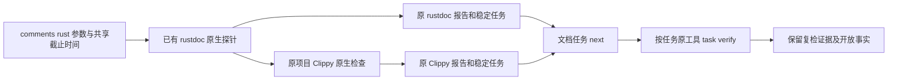

# Rust 独立注释入口的双原生观察

对应现有 OpenSpec 7.1、15.3、15.6 的局部进展，完整四核心生产资格仍未授予。

`codeguard comments rust . --cargo-tool /absolute/path/to/cargo --format=json` 现在顺序执行已有 rustdoc 库目标探针和原项目 Clippy all-targets 观察，共用已选 Cargo、截止时间和取消状态。JSON 使用独立 `rust_comments_feedback` 0.1 协议；原始 rustdoc 0.4 和 Clippy 0.2 保留在 `native_results`，原协议与 `check rust` 不变。原生报告分别持久化；封装报告不是可导入任务事实。未初始化项目不会创建 `.codeguard/`。

只从原生 `clippy::missing_errors_doc`、`clippy::missing_panics_doc`、`clippy::missing_safety_doc` 提取 Clippy 文档候选；其他规则保留在原报告，不能凭前缀冒充文档检查。统一 next 保留当前与历史开放文档任务及原检查器准备任务，本轮零诊断不丢弃待复检事实；无关Clippy开发规范任务不入选。零诊断不会签发完整文档合规。

组合 `local_scan_complete` 只有在两项原生观察完成、所观察源码/根清单/锁的前后快照稳定、Cargo字节身份相同时为 true。它不证明完整 workspace/features/目标覆盖。单项失败保留另一项事实；第一项耗尽预算后第二项没有新的时间额度；输入改变禁止组合完成。

TDD：最初两项新增公开入口测试因缺少组合报告失败；实现后覆盖双规则稳定任务/原工具复检、Clippy失败保留rustdoc、无关规则隔离、第二项改源码、共享超时。默认构建九个受影响CLI目标84项通过、9项条件忽略；WASM构建85项通过、9项条件忽略。原rustdoc回归通过原生子报告继续验证已有协议和事实边界；缺Cargo现在保留两个检查器各自的准备任务。

真实本机 Clippy 的三个规则分别完成统一入口扫描、仍存在复检、详细章节补齐后的原Clippy复检；全部原事实保持 open。默认和 WASM 构建分别留存[默认真实证据](evidence/rust-comments-combined-native.json)与[WASM构建真实证据](evidence/rust-comments-combined-native-wasm.json)，包含CLI摘要与Clippy版本。公开封装及两份原始子报告须通过闭合schema；不授予独立精度或生产资格。

仍未完成：详细说明内容与实现语义一致性、Clippy接受裸章节标题的漏检、完整成员/features/目标和生效规则覆盖、可信关闭/复发、五平台和宿主。不会隐式启用 pedantic、安装工具或修改项目策略。32份WASM资格仍0/32，父任务66完成/288待完成。

协议校验：475份schema元定义有效；默认/WASM共6份真实封装报告有效，36项伪造资格、组合输入不稳定、旧版本或无关规则变体被拒；项目不可用时的null Clippy报告也有效。

历史零诊断用例先暴露测试运输缺失finish记录；修正运输后，复现旧选择逻辑的同输入零诊断返回next=null，新增任务保留断言确实RED。过滤视图修复后保留旧开放文档任务。输入变化可产生actionable环境阻塞，但不能授权沿用旧源码位置；两者分别验证。
