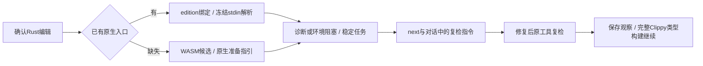

# Rust 编辑、稳定任务与原生复检的局部验收

日期：2026-10-06。对应现有 OpenSpec 9.3/9.9/11.17、14.6/14.9；父任务保持未完成。

确认写入后，Hook 只解析请求中的 Rust 普通文件，优先显式绝对路径 Rustfmt，其次绝对 PATH 目录现有入口。只在工具不存在时保留 WASM 候选；已选择的工具缺失、版本不适用或执行故障反馈 incomplete，不换工具隐藏失败。共享截止时间、取消、文件上限和源码/edition 前后复核仍生效。

原生定位诊断或环境问题进入稳定语法确认任务；重复扫描复用任务，next 提供原工具复检 argv。task verify 和 repair_ready 保存复检事件；零诊断只表示当前解析观察恢复，任务仍 open，完整 lint/类型/构建义务继续保留。变更 edition 后 next 撤回历史位置，失败写入不启动工具或创建工作台。

Claude 格式反馈曾遗漏 Rust 诊断，公开入口测试先失败后修正：现在显示 rust.syntax、安全行号、实际任务与复检指令；没有可靠列号时明确不可用，不回显宿主源码或原生自由文本。

新协议独立保存：原生上下文证据0.3、Rust扫描0.1/0.2、首次确认0.12、私有复检0.11、公开复检0.25、next0.19、Hook0.24/0.25。历史协议不改。七份实际受控工具报告见[evidence](evidence/rust-native-hook-controlled-2026-10-06.json)，不以夹具作为语法正确性 oracle。

固定本机 Rustfmt1.9.0-stable 的真实 edit→next→修复→task verify→repair_ready 与 Claude 格式链路另显式运行通过。它只证明本机适用版本及固定样例，不证明实际宿主自动执行或所有 Rust 版本。rustup 代理在空环境中未被认证，不将其故障伪装成无工具。

仍缺完整 Cargo 成员/target/模块/宏上下文、Clippy 编辑调度、正式可信关闭、独立语言精度、实际宿主、多平台与发行验收。资格仍0/32，交付未评估。

验证记录：WASM受影响七目标71通过/0失败/4条件忽略；默认首批Rust/Claude两个目标17通过/0失败/1条件忽略，新增PATH/edition/缺工具后另行重跑。真实安装Rustfmt链路1通过/0忽略；离线npm打包实装链路1通过（20.09秒）；七份实际协议及伪造反例两组通过；WASM全workspace全目标严格Clippy、分层与OpenSpec strict通过。末次默认构建结果独立追加。

末次默认四目标：30通过/0失败/3条件忽略。Erlang用户草稿SHA256仍为2e3a296072e6a3aa34b561799c18c7d8b621d00f8786301d2612cee8cdab85b6，未修改、暂存或作为oracle执行。

最终三目标WASM回归：25通过/0失败/2条件忽略；default/WASM全workspace全目标严格Clippy均通过，help默认另5通过。owned Rust格式检查通过，修改文档链接未发现缺失；全schema元定义通过。

