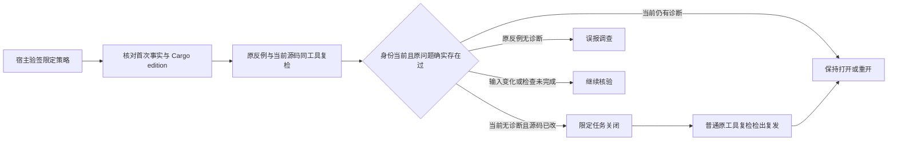

# Rust 原生语法任务关闭与复发（限定范围）

对应 OpenSpec 9.10 / S14；本次完成的是 Unix 宿主 SDK 的原生首次 Rust 语法任务关闭路径，不是全项目验收或真实宿主接线。新增 `RustTaskResolutionRequest` / `verify_rust_task_resolution`，复用现有批准验签、租约、尝试观察和生命周期父链。

## 执行与身份

策略 1.7.0 固定首次报告/原源码/工具/宿主适配器身份、原生规则 `rust.syntax`、Rustfmt1.9.0-stable，以及 Cargo edition 来源的完整五字段上下文。原生首次任务 `grammar_sha256=null`，不虚构 WASM 身份。旧策略不能带 Rust 扩展。来源与当前 edition 不一致在进程前拒绝；检查中声明变化成为 `inputs_stale`。

同一预算下先重放宿主冻结原反例，再重检当前文件。仅原反例有已核对的语法诊断、当前源码已变化、工具/上下文仍一致且完整零诊断时追加 code_fixed。重复验证复用事件；公开 `task verify --rustfmt-tool` 复检发现相同上下文复发时重开同一任务。

## 实际证据

- RED：新增端到端测试首先因缺少 Rust 请求及关闭 API 编译失败；新增 API 后完成测试。
- 受控工具：4 PASS、1 条真实工具用例条件忽略。覆盖关闭/幂等/公开复检重开/再次关闭、edition变化、伪造上下文、错误密钥/撤销/时钟/过期/防回滚/跨语言、原反例无诊断、运行中清单变化。7 份实际收据/策略/证据保存于 [受控记录](evidence/rust-task-resolution-controlled-2026-10-06.json)。
- 真实工具：独立运行 `real_rustfmt_resolution_and_recurrence -- --ignored`，1 PASS、0 ignore；直接使用 `/Users/wandl/.rustup/toolchains/stable-aarch64-apple-darwin/bin/rustfmt`，测得版本1.9.0-stable。4份输出证明 resolved、重复同事件、公开复检复发后open、再次resolved。签名密钥和宿主信任根是测试夹具，不能作为生产批准证明；见 [真实记录](evidence/rust-task-resolution-real-2026-10-06.json)。
- 封闭 schema 验收 `tests/rust_task_resolution_schema.py`：3 PASS；缺上下文、未知字段/版本、虚构grammar、外语规则、伪造列/非法行及错误完成状态被拒。

复现真实工具测试需设置 `CODEGUARD_RUST_RESOLUTION_TOOL` 为已安装直接制品，可用 `CODEGUARD_RUST_RESOLUTION_CAPTURE` 保存本轮输出；不安装或替换工具。受控反例独立运行，不把脚本当成真实原生 oracle。

共享关闭/Hook回归：WASM构建8个目标合计52 PASS、0 FAIL、9条真实工具条件忽略。上述真实Rustfmt用例另行执行，不把条件忽略记为通过。

默认构建的Rust关闭/Hook两目标14 PASS、0 FAIL、3条条件忽略。默认与WASM全workspace全目标严格Clippy通过；OpenSpec strict、分层、定向格式和diff检查通过。

CLI库WASM构建单测86 PASS、0 FAIL、3条条件忽略，包含既有关闭证据、快照、取消和原生观察协议回归。

## 尚未完成

普通 CLI 本地零诊断仍不自批关闭；真实宿主需要提供独立信任根和批准上下文，SDK API 不暴露项目自选公钥参数。Clippy、类型、构建、完整有效Cargo模型/模块/宏上下文、Windows、真实宿主、发布包仍需各自验收。原生首次使用本页协议；WASM首次已通过独立策略1.8/证据0.9接入同一SDK，见 [WASM首次验收](rust-wasm-task-resolution.md)，不借用本页的null grammar身份。项目交付固定 `not_evaluated`，语言低误报资格仍为0/32。9.10 / S14父任务保持未完成。
