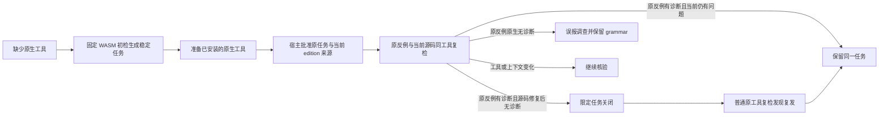

# Rust WASM 首次任务的原生确认、关闭与复发

对应 OpenSpec 9.10 / S14。本轮扩展既有 Rust 宿主 SDK，让缺工具时由 WASM 生成的同一任务也能经过原生确认、修复复检、限定关闭和公开 CLI 复发重开。生产宿主批准接线仍未完成；普通本地复检零诊断目前仍不自行批准关闭。

## 两种首次来源

| 首次来源 | 策略 / 证据 | grammar 身份 | edition 来源 |
| :--- | :--- | :--- | :--- |
| 原生 Rustfmt | 1.7.0 / 0.8.0 | null | 必须等于首次原生报告记录的声明来源 |
| WASM 初检 | 1.8.0 / 0.9.0 | 首次真实资产摘要 | 宿主批准的当前 Cargo 声明来源，不推断为首次历史上下文 |

使用同一 `RustTaskResolutionRequest` / `verify_rust_task_resolution`，没有项目自选公钥或自动生成批准的 CLI 参数。WASM 首次策略只接受已同步的 WASM 首次报告；不能把原生首次报告换成该版本，或以旧原生策略消除 grammar 身份。原反例、报告、任务、工作区、规则、工具和适配器仍逐项绑定。

安装或选择原生工具本身不算修复。原反例原生无诊断时，`next` / task brief 提供首次 WASM、grammar 版本与原生差异调查步骤，不继续要求修改合法源码，也不直接裁定 grammar 有缺陷。候选资格和项目交付状态不因任务生命周期变化升级。

## 实际验证

- RED：新 WASM 首次闭环测试先在现有策略校验处返回 `task_resolution_policy_scope_mismatch`；接入独立版本后通过。
- 受控增量：3 PASS。覆盖原生确认仍有问题、修复、幂等关闭、普通 `task verify --rustfmt-tool` 复发重开，缺/错 grammar、交换来源、错误工具身份、edition 变化，以及原生反证后的实际 `next` 和精确任务简报。WASM 原生反证是受控协议反例，不算真实解析器误报证明。
- 本机已安装直接 Rustfmt1.9.0-stable：独立运行两种首次来源完整链，2 PASS、0 ignore；本条 WASM 首次链保存 4 份实际输出，状态为 open → resolved → 同事件 resolved → 复发后 open，见 [真实记录](evidence/rust-wasm-task-resolution-real-2026-10-06.json)。信任根、签名和时钟仍为宿主测试夹具。
- [受控记录](evidence/rust-wasm-task-resolution-controlled-2026-10-06.json)保存 5 份本轮输出，包括 `false_positive_review_required`，不把它记录为 code_fixed。
- 共享关闭与 Rust Hook 的 8 个 WASM 测试目标：55 PASS、0 FAIL、10 条真实工具条件忽略。上述两个真实 Rustfmt 用例另行执行。
- `tests/rust_task_resolution_schema.py`：6 PASS，同时消费两个首次来源的新旧证据，拒绝缺/空/null grammar、来源交换、未知字段/版本与伪造位置。

复现真实链：先以 `--features wasm-precheck` 构建，在环境中显式设置 `CODEGUARD_RUST_RESOLUTION_TOOL=/absolute/rustfmt`，执行 `cargo test --locked -p codeguard-cli --features wasm-precheck --test rust_task_resolution_service real_rustfmt_ -- --ignored`。可用 `CODEGUARD_RUST_RESOLUTION_CAPTURE` 保存本轮输出；不安装或修改该制品。实际工具制品摘要和本轮宿主适配器摘要在证据中保留。

默认构建的Rust关闭/Hook两目标14 PASS、0 FAIL、3条真实工具条件忽略；默认与WASM全workspace全目标严格Clippy通过。OpenSpec strict、分层、定向格式、diff与新增验收链接通过，中英文架构文件命名校验2份/0错误。

## 未完成边界

SDK 的宿主批准路径不等于真实智能体宿主的自动批准接线。当前关闭仅为单文件语法任务，不批准 Clippy、类型检查、构建、完整项目模型、白名单或交付。Windows、其它检查族、实际宿主、独立精度和发布仍需验收，grammar 资格保持 0/32。当前普通CLI关闭仍受既有契约约束，没有自动授权或放宽白名单。9.10 / S14 父任务保持未完成。
