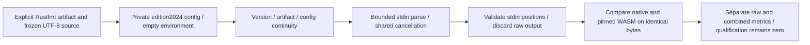

# Rustfmt controlled native differential — 2026-10-06

This acceptance slice verifies the Rust-owned developer replay adapter. It does not implement Rust editing Hook routing, infer project edition, replace Clippy, or approve a language/package release.

## Execution and authority



The adapter executes `--version`, then `--config-path fixed.toml --emit stdout --color never`. It deliberately avoids `--check`: formatting differences are not syntax violations. Each invocation uses the shared deadline and 2 MiB combined output limit, with source limited to 1 MiB and executable reads to 64 MiB. Tool aliases/content and private configuration are checked before parsing and afterward. This is controlled process execution, not a complete OS sandbox or project/module analysis.

The fixed installed rustfmt1.9.0-stable reports an unclosed delimiter beyond the last nonempty line's normal coordinate and reports an unterminated string as located E0765 with exit101. The implementation accepts only the bounded observed EOF case and validated error headers/stdin positions. Panic, foreign files, missing locations and invalid coordinates remain incomplete. Only the line and `rust.syntax` rule are exposed; formatted output, original source, arbitrary messages and uncertain columns are discarded.

## Reproduction

Use an already installed matching executable; do not install or silently substitute a tool:

```bash
cargo test --locked -p codeguard-cli --features wasm-precheck --test rust_formatter_differential
cargo test --locked -p codeguard-cli --features wasm-precheck --lib rustfmt_syntax_probe
CODEGUARD_RUSTFMT_BIN=/absolute/path/to/rustfmt \
CODEGUARD_RUSTFMT_REPORT=/absolute/path/to/report.json \
cargo test --locked -p codeguard-cli --features wasm-precheck \
  --test rust_formatter_differential \
  real_rustfmt_replay_parses_frozen_stdin_without_project_config_or_external_modules \
  -- --ignored --exact --nocapture
python3 tests/rustfmt_native_feedback_schema.py
```

The last command is a development schema test, not a Python product runtime. CI runs controlled replay and parser unit tests without claiming its preinstalled rustfmt matches the selected version.

## Observed evidence

[Captured report](evidence/rustfmt-native-differential-2026-10-06.json) uses differential schema0.8 and Rust parser observation0.1. It preserves 32 language inventory entries, selected language Rust, qualification0, `independent_holdout=false` and `delivery_decision=not_evaluated`. Source/tool/program/manifest digests bind this capture; it is a historical run, not automatically current after code changes.

| Scope | Result |
|---|---|
| Actual fixed tool replay | 16 cases; 5 TP, 11 TN, 0 FP, 0 FN, 0 unknown on both measured layers |
| Corpus origin | 14 historical cases plus 2 provisional isolation/formatting cases; no independent holdout |
| Controlled Rust integration | 1 passed; actual-tool test conditional unless explicitly selected |
| Rust parser units | 4 passed in each default/WASM configuration |
| Shared native checker units | 4 passed, including Rust in tool continuity/cancellation coverage |
| Rust/Go/JavaScript/Ruby integration | 8 passed, 6 actual-tool conditional ignores; Rust actual replay separately passed |
| Captured report protocol | 2 passed, including forged authority/edition/version/diagnostic/classification rejection |
| Strict workspace Clippy | Passed default and wasm-precheck with all targets |

The unformatted canary does not appear in reports. The external invalid module remains unchanged and outside parser coverage. Source fixtures contain no project execution; no SDK is installed. Historical corpora, grammar bytes and older schemas are unchanged.

## Remaining acceptance

Project edition discovery, Rust native-first edit routing, remediation integration, applicable Clippy/build/type obligations, real host feedback, independent per-version precision/performance cohorts, cross-platform installation and release qualification remain open under the existing OpenSpec parent tasks. This replay alone does not close those tasks.

Final capture was repeated after the last Rust source changes: controlled Rust replay1 passed/1 conditional ignore; explicit installed Rustfmt replay1 passed with all16 observations consistent; the archived final capture passed both schema regression tests. Layering, OpenSpec strict validation and documentation link checks passed. Remote CI and the complete WASM workspace suite are not claimed by these local results; the protected Erlang draft was excluded.
