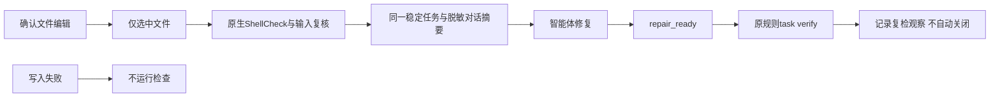

# Shell 原生编辑与修复 Hook 验收

日期：2026-10-06。事实源：`introduce-rust-codeguard-cli/hook-protocol`及native-tool-adapters，关联7.4、S09、S11、S14。当前验证Rust事件执行器、Claude格式适配、原生结果和npm离线安装；不证明真实已安装宿主会话、完整Shell能力或发行门禁。

## 路径与结果

`hook execute ROOT --shellcheck-tool /absolute/tool --timeout 30s --format=json`处理规范化事件。外层0.21、内层0.11编辑协议附带shell_native_scan 0.1；旧版本保持原文件。确认编辑采用同一受控探针、实际方言及最近项目配置，不扫描未编辑的文件、不执行脚本；显式选择失败不回退到其它工具或不存在的Shell WASM。

`repair_ready`先读取实际任务checker及历史预算，shell.shellcheck只接受匹配工具参数，再调用现有task verify。Shell原生封套版本和形状重新核对，输入变化撤回本轮观察；公开复检摘要仍采用既有0.7/0.1协议，仅投影观察、持久化状态、脱敏原因和扫描可用性，不伪造细节或可信关闭。

Claude格式摘要包含当前SC规则、Unicode标量行列、实际任务ID及原工具复检命令。自由文本原生消息、源码和宿主new_string不进入摘要，1200字符限制保留未完成声明。工作台未连接或同步失败明确说明，不编造任务。

## 实际与受控证据

本机ShellCheck0.11.0的真实临时工作区输出为`evidence/shell-hook-2026-10-06-{uninitialized,init,first,repeat,missing,claude,present,repaired,unsupported}.json`。源码是bash shebang和`echo $1`，SC2086复检still_present；改为引用参数后candidate_absent_unverified_policy，未关闭任务。缺工具通过隔离PATH实测；zsh返回支持阻塞。首次与重复编辑任务ID相同，未初始化时不自动创建工作台；临时目录已清理。

受控工具六项测试覆盖：只查编辑文件及重复任务；原规则修复前后观察；Claude当前字符位置/安全任务/拒绝工具指令文本；缺工具无虚构WASM；不支持方言及已选工具失败保持未完成；写入失败不检查、任务为零。携带预配置工具的失败写入也返回not_run/write_failed；实际CLI反例原先返回参数错误，修复后保存failed-configured输出，npm以执行标记验证不启动工具。初始四项全RED，修复后通过。后加写入失败夹具先因遗漏必需timeout失败，补齐后验证产品行为；不将错参失败当成功的写入失败验收。

离线npm安装测试使用独立缓存和本地tarball，受控ShellCheck证明Node launcher及已安装二进制的编排一致性。编辑、重复编辑、聚合检查、单文件lint、next、Claude格式、修复前后、输入变化及再次出现复用原任务；finding仍open。最终源码1通过、0失败、0跳过，约24秒；执行标记不存在，失败写入未启动工具。输出为`evidence/shell-npm-repair-2026-10-06.json`，十一份响应中十份结构化协议分别校验，Claude摘要另核验位置、task ID和字符上限。该测试不替代真实ShellCheck精度或实际宿主安装验收。

## 回归与边界

相关Hook/Shell/Ruby回归通过，最终源码的全量及WASM结果见下文；两种配置workspace all-targets严格Clippy通过。schema两项分别验证真实报告及安装后报告，拒绝未知版本、未知字段、假allow、假宿主阻断权威和原生message注入。格式、layering、OpenSpec strict及差异检查通过。

最终源码默认全工作区262个结果目标：1452通过、0失败、126忽略（shell-hook-workspace-final.log）。WASM最终相关七目标64通过、0失败、3忽略；默认/WASM最终严格Clippy通过。最后另构建WASM二进制执行安装链路，不用先前输出证明最终源码。WASM只执行相关目标，不使用用户未提交的Erlang差分草稿作为验收oracle。真实Claude/Codex/Gemini会话、完整Shell源依赖/安全/平台覆盖、签名关闭与复发及发布仍开放；父任务不勾选。
