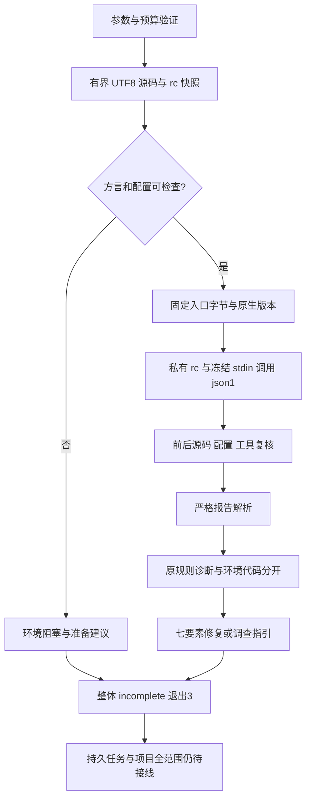

# ShellCheck 原生单文件局部验收

日期：2026-10-06。对应 OpenSpec 7.4（仍开放）、native-tool-adapters 的方言/配置/报告契约。本记录证明单文件真实原工具调用和局部反馈，不证明整个 Shell、Dockerfile/IaC、持久修复任务、平台隔离或发行能力。

## 入口和执行路径

```bash
codeguard lint shell app.sh --dialect bash \
  --shellcheck-tool /absolute/shellcheck \
  --shellcheck-config /absolute/.shellcheckrc \
  --timeout 30s --format json
```

rc 参数可省略。工具显式路径优先，否则使用调用者绝对 PATH 中的首个普通可执行入口；所选入口失败不改选其它工具。支持 sh/bash/dash/ksh/busybox；zsh/fish、未知解释器和已知 zsh 文件名提供未支持反馈，不尝试 Bash 或不存在的 Shell WASM。



自动项目 rc 读取最近 `.shellcheckrc`/`shellcheckrc`，最多64层祖先；显式 rc 必须绝对路径。源码≤1MiB、rc≤32KiB、工具入口≤128MiB、原生 stdout/stderr 总预算128KiB、诊断≤128。HOME/XDG 全局配置不加载；原生内置规则与项目 configured/missing 状态分离。链接/无法读取/坏UTF8配置以及 external-sources 启用/歧义保持未完成，不读取任意 source 文件。脚本本身不执行，不自动 fix、不安装工具。受控子进程共享请求截止时间；文件读取/摘要不是已验收的硬实时执行预算。

[ShellCheck 官方协议](https://github.com/koalaman/shellcheck/blob/v0.11.0/shellcheck.1.md)定义 json1/退出码、原生配置和 source 边界；[SC1071](https://www.shellcheck.net/wiki/SC1071)说明未支持的方言。SC1071/1090/1091/1092/1134/1144/1145作为环境代码，不制造源码 finding。有效 SC2086 等兄弟诊断保留，整体仍未完成。json1 列按字符计数，tab=1；输入有效UTF8时映射为Unicode标量，不采用旧 json 的 tabstop8。

## 实际证据

`evidence/shellcheck-2026-10-06-{diagnostic,suppressed,source-blocker,zsh,unicode,tab-crlf,safe}.json` 由本机 `/opt/homebrew/bin/shellcheck` 0.11.0 实际调用产生。记录中的临时源码已清理，保留本轮摘要、脱敏定位和工具入口摘要；不是声称旧路径仍可读取或所有平台均已运行。

| 样本 | 观察 |
|---|---|
| diagnostic | SC2086 line2/column6，保留原规则并给出修复简报 |
| suppressed | 原 rc disable=SC2086 后零诊断，保存配置摘要；不称修复完成 |
| source-blocker | SC1091环境阻塞与SC2086兄弟诊断共存，只给调查指引 |
| zsh | 不支持方言，不启动源码检查，不报假语法违规 |
| unicode | 你好$1 的原生SC2086列8，与字符语义一致 |
| tab-crlf | 保留SC1017及SC2086；tab计1，CRLF边界合法 |
| safe | 引号和printf原生零诊断，完整交付仍未评估 |

`schemas/shell-lint-feedback-v0.1.schema.json` 封闭协议固定25个顶层字段，拒绝假allow、可信批准、自动安装、假任务完成、额外message/fix字段、零列、错版本和无有效身份的完整原生状态。`tests/shell_lint_feedback_schema.py` 实测七份报告并核对简报对应原诊断。当前help升级0.4.0，旧0.1/0.2/0.3 schema保留，旧消费者拒绝新协议。

报告包含证据、官方规则依据、允许范围、修复步骤、原工具复检argv、历史状态和关闭条件。未完成证据没有允许修改路径。`task_workflow_status=not_integrated`和`history_status=not_integrated`不能被空历史伪装；本接口尚不创建或关闭稳定任务。工具入口摘要不证明动态库闭包、可信签发、网络/内存隔离或全局检查义务。

## RED / GREEN 与回归

初始 adapters 契约因 API 未实现失败；初始 CLI 契约因入口不存在失败。真实 ShellCheck 最初超出64MiB入口预算，明确返回未完成；测量本机入口70,551,184字节后，将该入口预算提高至128MiB，仍保留预算和摘要验证。不存在跳过工具来换取通过。

默认 workspace/all-targets：259个结果目标，1429通过、0失败、126忽略；日志 `/private/tmp/codeguard-shell-default-workspace.log`。忽略测试不计入真实工具验收。随后按新增代码修正一处 Clippy 可折叠条件，再运行受影响回归。

WASM feature 定向Shell入口、help与legacy协议：真实工具环境变量明确选中本机0.11.0，Shell目标9通过、0失败、0忽略（包括真实工具测试）；不读取或执行受保护的Erlang未提交差分文件。首次误选不存在的argv_contract测试目标被Cargo拒绝，随后改用已有legacy_v1_protocol_contract，不记作通过。

严格 Clippy、分层、OpenSpec strict 和最终测试结果在实际完成后追加。不得由本记录关闭7.4；持久任务、Shell项目调度、原生规则覆盖、zsh专用检查、Dockerfile/IaC和其它平台仍开放。

## English boundary

This accepts a Rust-driven, fixed-version ShellCheck single-file observation and bounded repair brief. Native rc suppressions remain distinct from approved CodeGuard exceptions and code repair. Environment codes coexist with valid local diagnostics; unverified evidence cannot authorize source edits. No Shell WASM fallback or persistent task closure is claimed. Project-wide coverage, Dockerfile/IaC, full policy authority, cross-platform isolation and distribution remain open under 7.4.

最终默认/WASM workspace/all-targets 严格 Clippy 均通过（日志 `/private/tmp/codeguard-shell-clippy-{default,wasm}.log`）；修正一处嵌套if，没有添加lint豁免。WASM定向目标合计17通过、0失败、0忽略；新Shell反馈schema两项通过，真实七份报告及反例均校验。分层、定向格式和OpenSpec strict通过。Ruby帮助schema验收随help0.4升级，旧报告schema不改写。曾在未构建标准二进制路径时跑Python动态验收，明确失败为FileNotFoundError；随后显式构建当前WASM二进制再复跑，不能将此前错误算作通过。

当前Ruby协议回归3通过、2显式跳过（未选择历史真实Ruby捕获目录）；Shell协议2通过。受保护Erlang草稿SHA256仍为2e3a296072e6a3aa34b561799c18c7d8b621d00f8786301d2612cee8cdab85b6，未编辑或用于WASM测试验收。
