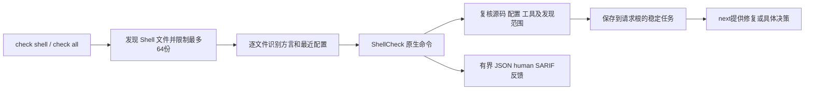

# ShellCheck 项目扫描局部验收

日期：2026-10-06。规格事实源：`introduce-rust-codeguard-cli/native-tool-adapters`，关联任务7.4、S09。本记录验证统一项目入口的逐文件原生观察、稳定任务和异常分流；不代表完整 Shell 或项目交付验收，父任务保持开放。

## 执行路径



```bash
codeguard init /absolute/project --apply
codeguard check shell /absolute/project --shellcheck-tool /absolute/shellcheck --format=json
codeguard check all /absolute/project --shellcheck-tool /absolute/shellcheck --format=json
# 无有效 shebang 时才使用确认过的默认方言
codeguard check shell /absolute/project --shell-dialect bash --format=json
```

显式工具优先，否则发现 PATH 工具；无有效工具不会隐式安装。默认方言不能覆盖 zsh/fish 或文件已经声明的实际方言。无法识别与不支持的方言生成具体决策指引，不让智能体反复重装 ShellCheck。

## 真实工具报告

`/opt/homebrew/bin/shellcheck` 0.11.0 对临时工作区的两个 bash 文件执行；源码为 shebang 和 `echo $1`。`evidence/shell-project-2026-10-06-*.json` 保存当前入口的八份实际输出：init、first、repeat、all、missing、unknown-dialect、unsupported、sarif。生成后清理临时工作区；不保存源码或原生诊断消息。

first/repeat/all 的每文件原SC2086及稳定任务均保留，重复检查更新同一任务。缺工具、未知方言和zsh分别报告环境或支持边界；未知/不支持方言的next为needs_decision。SARIF保留两条有界原生诊断，executionSuccessful=false；公开反馈不投影私有源码位置。

统一反馈版本0.52.0，嵌套shell_native_scan 0.1.0。`local_check_complete`仅表示发现范围内本轮逐文件观察完整；即使为true，coverage_proven=false、delivery_decision=not_evaluated。`native_task_started`表示进入原生探针阶段，不证明成功启动子进程、完成检查或满足项目门禁。

## 反例及回归

`check_all_shell`的八项行为验收覆盖：逐文件规则和重复扫描唯一任务；缺工具及不自动初始化；嵌套工作台不能夺取请求根任务；未知/不支持方言；67文件仅观察64份且3份未观察；检查期间源码突变撤销当前观察；默认方言不能强制覆盖实际方言；实际SIGINT终止后退出130且不创建环境任务。

SIGINT反例曾发现取消后误建两个环境任务、启动计数为0。修复后在受控工具版本阶段发实际信号，保持启动计数1、任务数0。该测试使用受控工具，不伪称真实ShellCheck的取消验收，也不证明所有task verify取消路径。

SARIF反例先因原生Shell结果未进入投影而失败；修复后只保留input_stable=true诊断。未知方言next反例先误为actionable；修复后为needs_decision。

本批取消修复后的default相关六目标：50通过、0失败、5忽略；WASM相关七目标：58通过、0失败、5忽略。最后的源码可用性分支重构再次执行三项目标，default与WASM各23通过、0失败、1忽略。两种配置workspace all-targets strict Clippy通过。实际报告schema六项验收通过，含伪allow、伪trusted、未知字段及当前输入失效反例。

此前全workspace基线259目标、1442通过、0失败、126忽略，位于取消修复之前；本记录保留其历史意义，不作为最终源码的全workspace证明。WASM只运行明确相关目标，不执行用户正在维护的Erlang原生差分草稿。

## 仍开放的验收范围

完整源文件source跟随和项目义务、可信政策关闭与复发、其他Shell专用工具、Dockerfile/IaC、跨平台、实际宿主对话和发行验收仍未完成。全量语言任务与7.4/S09不能根据本局部报告勾选。任务删除、诊断为零或工具安装成功不允许签发项目allow。

## 2026-10-07 增量：方言保留与配置安全反例

`check_all_shell` 新增两项回归锁定（均为既有正确行为加锁，不是新修复）：`env -S zsh`/`env zsh` shebang 与 `.zsh` 扩展一样保留 `dialect=zsh` 并以 `shell_dialect_unsupported` 阻塞原生执行，不被默认方言吞掉也不产生诊断；根 `.shellcheckrc` 启用 `external-sources=true` 时只阻塞受它影响的根文件（`native.reason=shellcheck_external_sources_unverified`、`project_configuration.status=unknown` 且不暴露为已选配置），同轮嵌套目录选到自己的干净 rc 的文件原生观察照常完成——配置安全故障与原生结果互不掩盖，也不冒充缺工具或无问题。本轮受控工具 10 通过、0 失败；真实 ShellCheck 0.11.0 单文件目标（配置抑制/不执行源码）另行通过。Dockerfile/Hadolint 仍未接入，7.4 对应半项保持开放。
