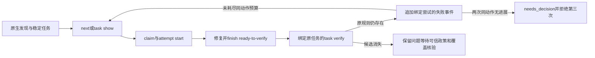

# ShellCheck 原工具任务复检验收

日期：2026-10-06。规格事实源：introduce-rust-codeguard-cli/native-tool-adapters，关联7.4与S09。范围为已初始化工作区的单文件原SC规则组复检；不是完整Shell能力或可信关闭验收。

## 行为和证据

`codeguard task verify CG-… PROJECT --shellcheck-tool /absolute/shellcheck --format json` 从首次私有报告及摘要绑定文件、方言、原显式rc和规则组。工具入口每轮重新核验。公开反馈为task_verification_preview 0.24.0，私有封套为shellcheck_task_recheck 0.1.0；与已有0.6预检失败反馈和其它语言协议分开。

真实 `/opt/homebrew/bin/shellcheck` 0.11.0 运行记录位于 `evidence/shell-task-2026-10-06-{first,present,rc-disabled,comment-disabled,fixed,fact}.json`。执行的最小源文件为bash shebang及 `echo $1`，修复改成 `echo "$1"`。临时工作区执行后清理，记录不包含源码和原生消息。

| 本轮条件 | 反馈 |
|---|---|
| 原SC2086仍存在 | still_present |
| 原rc新增disable=SC2086，零诊断 | rule_coverage_requires_review |
| rc恢复、添加disable注释，零诊断 | suppression_requires_review |
| 移除注释并引用参数，零诊断 | candidate_absent_unverified_policy |

四次复检均记录event_persisted=true；最终finding.state仍为open。注释检查是保守文本观察，可能命中heredoc中的注释外观，不证明实际有效抑制；只能要求审查，不能生成源码违规或关闭。

## 回归与边界

既有租约、失败尝试和next历史读取现能识别此封套及shellcheck时间序列。输入或配置改变后的历史不作为当前结果使用。新的复检不得伪造首次报告没有的SC规则。首次检查和复检复用zsh/fish文件名判断。不相关原生工具参数在租约前拒绝。

新增--ruff-tool反例先失败：参数被忽略并写入复检事件（`/private/tmp/codeguard-shell-wrong-tool-red.log`）。修复后相关目标通过。首次任务复检新增接线先因未知参数失败；第二次复检曾暴露历史消费者未识别新报告类型，该问题已修复。

默认全workspace：258个测试目标，1433通过、0失败、126忽略（`/private/tmp/codeguard-shell-task-workspace.log`）。WASM相关六个目标：71通过、0失败、13忽略（`/private/tmp/codeguard-shell-task-wasm.log`）；不运行用户正在维护的Erlang原生差分草稿。default/WASM workspace all-targets strict Clippy均通过（对应clippy-default/wasm日志），layering、OpenSpec strict、diff检查通过。修改的模块格式检查通过；lib.rs保持现有声明顺序，使用skip_children=true/reorder_modules=false/reorder_imports=false，不递归格式化他人文件。`tests/shell_lint_feedback_schema.py`四项通过，实际报告及假allow/假关闭/未知字段/空finding规则反例通过协议核验。

## 尚未完成

next专用复检和task show工具参数保留已在下面的指引增量验收中完成。可信政策/覆盖的关闭、复发、完整项目覆盖（有界逐文件调度见[项目局部验收](shellcheck-project-baseline.md)）、zsh/fish专用工具、Dockerfile/IaC、跨平台、完整宿主和发行仍开放。父任务7.4与S09不勾选。

## 任务指引与无进展增量验收

next协议0.17、task show协议0.3和新Markdown任务提供task verify，不要求智能体自行重建原方言/rc。保留0.16schema及历史报告。已有Markdown不覆盖，task show/next提供当前可读指引。

新next反例先因0.16/lint命令失败（`/private/tmp/codeguard-shell-next-red.log`）；Markdown仍指向lint的反例失败（shell-projection-red.log）；task show外层动作丢失工具参数反例失败（shell-show-red.log）。修复后受影响回归通过。

真实ShellCheck0.11.0执行两次ready-to-verify尝试，原SC2086均存在，两个verification_observed事件分别绑定attempt_id。next从actionable变needs_decision，no_progress_count=2，第三次attempt start为no_progress_budget_exhausted。原finding仍open。这是保留原输入、没有有效修复的负例，不声称源码已改或环境已恢复。证据为 `evidence/shell-next-2026-10-06-{initial,after-0,after-1,verify-0,verify-1,event-0,event-1,retry-denied,fact}.json`；另一个临时工作区的show.json验证task show外层和任务内argv一致。

本增量不实现可信关闭/复发，7.4/S09完整任务保持开放。本增量default相关六目标68通过/0失败/12忽略（guidance-targets.log与status-show.log）；WASM同六目标68通过/0失败/12忽略（guidance-wasm.log）；default/WASM workspace all-targets strict Clippy均通过。五项实际报告schema验收、layering、OpenSpec strict和差异检查通过。上一轮1433项全workspace通过记录保留为上一源码基线，本轮执行与next、task show、投影和尝试历史有关的回归，不借旧结果证明当前全workspace。
