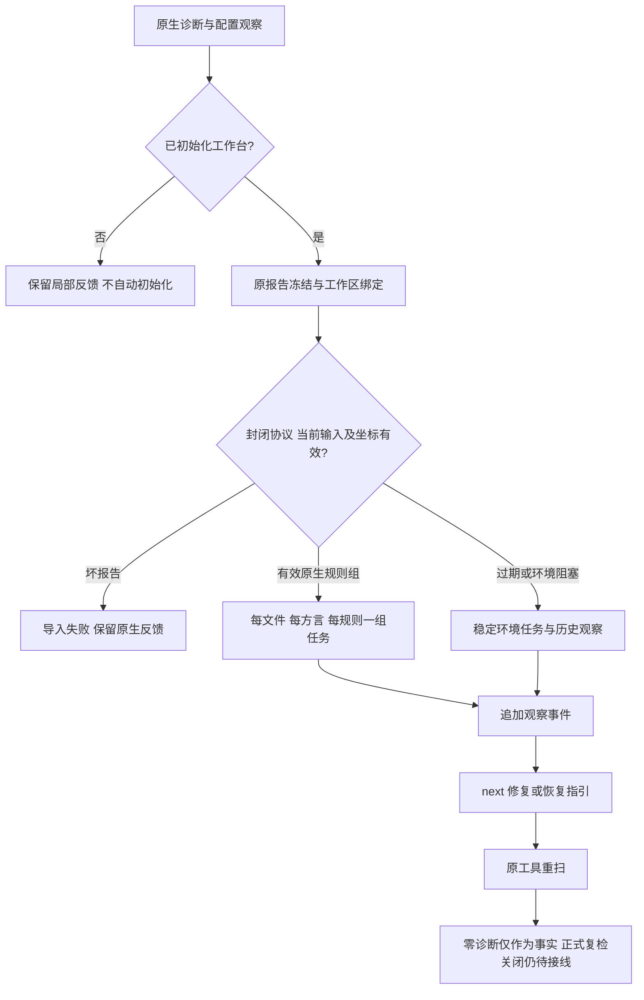

# ShellCheck 工作台发现与修复指引局部验收

日期：2026-10-06。延续 `shellcheck-native-baseline.md` 的单文件原生入口；对应 OpenSpec 7.4、S09及native-tool-adapters增量。不是完整Shell/Dockerfile/IaC、正式task verify/关闭、复发、真实宿主或发行验收。

## 持久化契约

已初始化工作区：原生检查 → 有界0.1.0 `shellcheck_workbench_observation` → 已有工作台报告导入事务 → 稳定事实/追加事件 → Markdown投影 → `next`。未初始化保留0.1.0局部反馈，不自动初始化。已初始化反馈为0.2.0，实际同步失败显式incomplete，原生发现不删除，任务引用不伪造。

任务稳定单位为工作区内文件×显式方言×原SC规则位置组。所有位置在本轮原报告中保留；同规则多个位置不是声明为一个语义缺陷，同规则不同文件/方言分别归组。组身份不含行号、完整源码摘要或本轮报告ID，重复扫描更新同一事实。环境恢复任务按文件×方言稳定归并，具体工具/配置/依赖原因在追加报告中保留，不因不同原因创建多个同范围环境任务。

导入按封闭字段、工作区/文件名/run身份、工具版本/摘要格式、规则/严重性、源坐标、报告完成条件和配置身份核验。当前字节一致时用既有json1解析器重新核对坐标，坏报告失败而非部分可信批准。源码过期记历史/环境调查，不创建可修改源码的新发现；路径别名越出原物理目标拒绝。事实始终local_unverified/not_evaluated。

`next` 的0.16.0协议提供同方言、原显式rc的ShellCheck复检argv；工具绝对入口是需要核验的参数，不能用随意工具确认。原始源码/rc变化后指引变verification_required，不再按旧位置直接修改。任务投影含证据、规则依据、范围、步骤、复检、历史和关闭条件。原生零诊断、rc disable、同步、Markdown勾选或删除不能关闭事实。

## 实测与反例

新 `shell_workbench` 目标先因功能不存在失败（修正初始化本身返回3的测试前置后，RED确实为缺少workbench反馈/未保存报告）。三个GREEN覆盖：重复扫描单组与零诊断不关闭、伪造零列报告拒绝、rc变化撤回actionable及不同配置失败同一环境任务。

rc变化反例最初确实失败：旧源码字节相同时仍actionable。修复后 `next` 同时复核原rc（含最近缺项），撤回指引为verification_required。只是根据原记录检查当前身份；最新观察选择、原生尝试绑定及正式关闭仍需下一阶段，不把首次证据视为完整历史。

本机ShellCheck0.11.0实测归档：

- `evidence/shell-workbench-2026-10-06-{first,repeat,suppressed,clean}.json`：四次原生检查；重复诊断同一个真实任务ID；disable后和源码修复后零诊断均不能关闭。
- `...-{next-suppressed,next-clean}.json`：两次next都要求核验；原工具方言参数明确。
- `...-observation-{0,1,2,3}.json`：实际四份工作台原报告，含摘要/配置/定位，无原始源码、自由文本指令或fix。
- `...-fact.json`：最终仍open的一张规则组事实。临时路径已清理，归档不声称旧路径仍存在。

新反馈0.2.0、原观察0.1.0和next0.16.0独立封闭schema校验真实捕获；旧0.1.0反馈和0.15.0 next消费者拒绝新协议。开发期Python验证只是既有schema工具，不进入Rust产品运行时。

默认workspace/all-targets：260个结果目标，1432通过、0失败、126忽略，日志 `/private/tmp/codeguard-shell-workbench-workspace.log`。当前受影响默认四目标37通过、0失败、3忽略。真实ShellCheck链路另实际运行，不把忽略的Ruff测试计为通过。

WASM定向第一次错误地将 `--include-ignored` 用到整组目标：Shell真实测试通过，但两个Ruff目标因未提供CODEGUARD_RUFF_BIN失败（日志 `/private/tmp/codeguard-shell-workbench-wasm.log`）。随后按各工具前置分开运行普通回归与明确选中的ShellCheck真实目标；不安装Ruff、不把这次失败改称成功，不把缺前置测试当作产品代码失败。

## 未完成边界

当前仅完成单文件发现、位置组任务、环境任务及next指引。Shell专用task verify、任务尝试与本轮原生结果绑定、可信关闭/复发、project-wide调度、zsh/fish专用能力、Dockerfile/IaC、完整政策/白名单和发行仍未验收。7.4、9.x父任务继续开放。

## English scope

This accepts local ShellCheck rule-group persistence and repair guidance through the existing workbench. Group identity is file/dialect/native-rule based; all native positions remain in original observations. Environment reasons remain separate, malformed reports are rejected, and changed source/rc withdraws actionable historical positions. Four real native observations retain one open task through suppression and repair. Dedicated verification, trusted closure, recurrence, native attempt binding, project coverage, Dockerfile/IaC, actual hosts and release remain open.

最终WASM普通受影响五目标：38通过、0失败、3忽略，日志 `/private/tmp/codeguard-shell-workbench-wasm-final.log`。真实ShellCheck明确单独选择0.11.0：1通过、0失败、0忽略，日志 `/private/tmp/codeguard-shell-workbench-real.log`。真实工作台四轮观察和两次next归档独立通过三项schema测试；默认严格Clippy、定向格式、分层及OpenSpec strict通过。未执行完整WASM workspace测试，以保护用户Erlang草稿；该草稿摘要仍为2e3a296072e6a3aa34b561799c18c7d8b621d00f8786301d2612cee8cdab85b6，未修改或暂存。

WASM workspace/all-targets严格Clippy最终通过（日志 `/private/tmp/codeguard-shell-workbench-clippy-wasm.log`）；包括受保护草稿的编译检查但不运行它作为验收oracle。默认和WASM Clippy均不是跨平台工具或发行资格证明。
