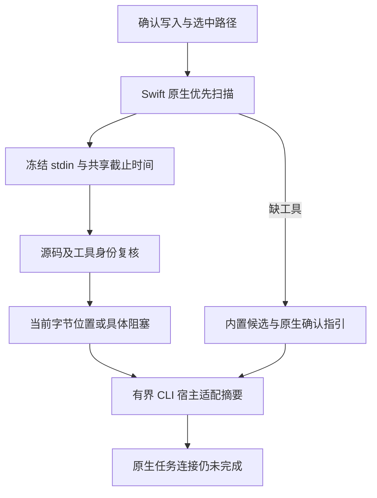

# Swift 确认保存原生优先反馈：局部验收

对应 `introduce-rust-codeguard-cli` 8.11、14.7、14.9、14.14、14.19。确认 `file_changed` 通过 `hook execute . [--swift-tool ABS_PATH]` 复用 Swift 项目 scanner，只检查本次选中的普通 Swift 路径；未触及文件不检查。显式工具优先，否则选择调用环境绝对 PATH 的首个 `swiftc`。只有缺工具保留候选，已选入口故障不改走 WASM。

新外层协议 `hook-execution-feedback`0.12.0，局部协议 `hook_fast_feedback`0.4.0，原生 Swift 结果仍使用 `swift-parse-scan`0.1.0。新协议中 Kotlin 可为空，Swift结果为真实对象；非 Swift 保存保持既有版本。原生 Swift 任务同步仍明确 not_connected，没有伪造任务ID或关闭许可。

CLI Claude 适配摘要统计当前 Swift 语法诊断，显示 UTF-8 字节位置；不回显原始工具诊断文本。有界摘要最长1200字符。混合范围出现候选疑似错误或未定位恢复时，`require_native_lint_confirmation` 优先于 `repair_native_source`；不能因另一文件已有原生诊断而弱化准备原生工具的要求。工具参数不适用的其它事件仍拒绝，而非静默忽略。

## 实际证据

[固定证据](evidence/swift-native-hook-2026-10-05.json) SHA-256：`f939d103674a355106e1c9ad33d20d5d96aab9940e4f063eaf150b3168fed826`。

本机 Apple Swift6.4 对错误与合法源码执行两个直接 Hook 用例，空 PATH 执行缺工具回退；同一真实编译器另用于错误、合法两个 CLI Claude 适配摘要。每个临时项目包含未选中的错误文件，直接 Hook 报告只观察 App.swift。三份直接 Hook 报告满足0.12协议，旧0.11消费者拒绝；两份摘要满足计数、位置、长度与任务缺口约束。程序前后摘要不变。输入事件由开发验收构造，`actual_claude_host_verified=false`：不以命令行适配输出替代真实宿主触发和可见对话验收。

## 测试

初始三个测试因缺原生保存接线与对话摘要而失败。混合范围新增用例独立暴露原生修复动作覆盖候选确认动作的问题，调整优先级后通过。WASM六项新测试、默认五项新测试通过；混合用例仅在WASM构建执行。测试还覆盖选中范围、显式/PATH优先、工具版本失败不回退、诊断消息指令注入不进入摘要、缺工具候选和空任务引用。

WASM受影响回归：Claude12 passed / 1 ignored，Hook执行19 passed / 2 ignored，Kotlin首次原生5 passed；条件忽略不计作真实原生工具执行。四项实际报告协议测试通过，拒绝过期位置、伪造任务、项目交付及宿主阻断声明。其它本地检查终态追加于下；新Linux终态须独立验证。

## 保留缺口

Swift 原生首次发现仍未接通稳定任务和可信关闭/复发；完整SwiftLint、类型、注释、安全与项目构建、已安装宿主实际触发、32语言完整资格及公开发行仍未完成。保存观察不能取代完整交付检查，不勾选父任务。公开 npm0.1.4、插件锁和 grammar 字节未改变。

最终本地检查：默认与WASM all-targets严格Clippy通过；fmt、分层和OpenSpec strict通过；229份schema元定义有效，228份旧schema字节不变，相关中英文文档本地链接有效。新远端结果待验证。
