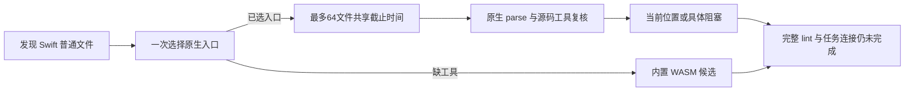

# Swift 项目原生优先观察：局部验收

对应 `introduce-rust-codeguard-cli` 8.11、14.7、14.19。开发源码的 `codeguard check all . [--swift-tool ABS_PATH] --format=json` 增加 Swift 冻结单文件 parse 批次。显式工具优先，否则选择调用环境绝对 PATH 的首个普通可执行 `swiftc`；当前只接受 Apple Swift 6.4。

已选工具不支持、执行失败及超预算均保留原生阻塞，不能换 WASM 抹去失败。超过64文件明确未观察；被选原生工具的超范围文件也不换候选掩盖原生范围缺口。原生位置使用 UTF-8 字节列；源码内容、入口目标或工具字节变化撤回位置和复检 argv。

`check-feedback`0.43.0 新增 `native_results.swift_lint`，内部协议 `swift-parse-scan`0.1.0。无 Swift 文件时保持原有版本与字段集合；旧 schema 拒绝新版。`local_parse_complete` 只说明本轮有界语法观察完成，诊断存在时也可为 true，不表示无违规或项目通过。

## 实际证据

[三份固定报告](evidence/swift-native-project-2026-10-04.json) SHA-256：`588bc800b3e1edb6664099fa68df8a2576049f292e59508c9dd54bccfcc17e91`。

本机 Apple Swift 6.4 执行缺参数类型与合法结构两种项目；空 PATH 执行同一错误源码的候选回退。原生错误记录第1行第13字节列；合法源码原生 completed 仍退出3、交付 incomplete。三份实际报告全部满足0.43协议，旧0.42消费者全部拒绝；源码摘要和程序执行前后摘要已复核。固定证据的 base_commit 是接线前提交，uncommitted_project_wiring=true 说明捕获时状态，不伪造发行提交身份。

## 验证

最初两个项目入口测试因参数未支持和原生结果缺失失败，详见本地 `/tmp/codeguard-swift-project-red.log`。扩展后的项目测试默认与 WASM 各5 passed / 0 failed / 0 ignored；Swift独立入口各9项回归通过，Kotlin首次原生WASM5项通过。新增四项实际协议测试拒绝过期位置、伪造任务连接、超范围完整及交付放行。Linux CI 新增 `check_all_swift`，远端结果须独立等待；本地检查终态补充于下。

## 保留缺口

项目原生结果尚未连接稳定任务，`task_status=not_connected`、task_id=null，聚合未完成条件明确 `swift_native_task_connection_not_implemented`。缺原生工具时仍由既有候选任务路径处理，不能用该路径冒充原生任务接线。保存 Hook 首次原生观察已见[后续局部验收](swift-native-hook.md)；原生任务连接、SwiftLint、注释、类型/依赖/安全、跨模块构建、完整资格及发行验收仍待实施。单文件已有 task verify 不等于本项目首次发现已形成修复闭环。父任务保持未完成；本轮不更改公开 npm0.1.4、插件锁或 grammar 字节。

本地串行回归：32grammar项目10 passed / 0 failed / 0 ignored；Hook执行19 passed / 0 failed / 2 ignored。Hook任务首轮14通过、1失败，失败是该项目测试仍断言旧聚合0.40版本；现改为0.43并增加缺原生选择和任务连接未完成断言，原稳定ID/next/重复扫描断言全部保留，单独复跑结果追加。

上轮提交的远端37213692814在Swift独立入口2例失败、7例通过，MSRV通过。模拟编译器未消费冻结stdin即退出，与Linux的native execution incomplete反馈一致；本轮模拟器在parse分支显式读取stdin，产品对写入失败的拒绝行为不变。新远端结果待验证，不能以本机通过替代Linux证明。

修正后终态：旧版本断言目标1 passed / 0 failed；消费stdin的Swift项目默认/WASM各5项、独立入口各9项通过；最终WASM all-targets严格Clippy通过，默认严格Clippy本轮已通过。4项实际协议测试、228份schema元定义、226份旧schema字节不变、分层及OpenSpec strict已验证。新Linux终态仍待验证。
