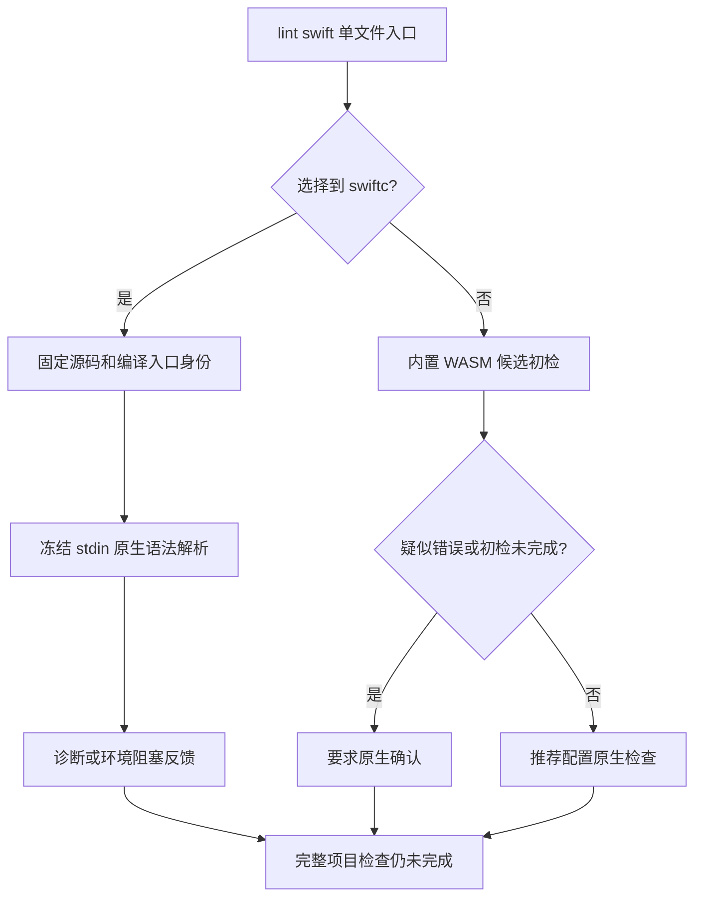

# Swift 原生优先单文件入口：局部验收

对应 `introduce-rust-codeguard-cli` 的 8.11、14.7、14.19。本次接通 `codeguard lint swift FILE.swift --format=json`；先选择显式 `--swift-tool`，否则选择 PATH 首个普通可执行 `swiftc`，仅工具缺失时使用内置 Swift WASM。当前支持 Apple Swift 6.4 的 frontend parse，不宣称完整 SwiftLint 或项目级质量通过。



选定原生入口后的版本不支持、超时、异常输出或身份变化均保留具体阻塞原因，不切换工具或伪装为 WASM 通过。错误坐标必须匹配冻结源码 UTF-8 字节边界；源码变化撤回诊断。工具身份仅覆盖编译入口，不代表整个 SDK 或工具链。

## 实际执行证据

[固定证据](evidence/swift-native-single-file-2026-10-04.json) SHA-256：`00f6dd36e0d150b38f72738635044123add9d1c0d6c41d4b8425dd94726db56c`。

本机 Apple Swift 6.4 执行了合法结构、缺参数类型、emoji、文件末尾错误和未知类型五个用例；空 PATH 执行隐藏恢复错误、零恢复节点两个 WASM 回退用例。未知类型在 parse 阶段没有诊断，正好说明语法检查不能替代类型检查。所有七份结果退出 3，项目交付未评估；证据保留实际报告及其摘要，程序执行前后字节一致。

实际缺参数类型报告的关键字段如下；完整报告见证据文件，省略路径和工具摘要不是新协议：

```json
{
  "schema_version": "0.1.0",
  "report_type": "swift_lint_feedback",
  "scope": "single_frozen_swift_file",
  "native": {
    "status": "diagnostics_observed",
    "reason": "swift_native_parse_diagnostics",
    "version": "Apple Swift 6.4",
    "diagnostics": [{"line": 1, "column": 13, "rule_id": "swift.parse.error"}]
  },
  "native_identity_scope": "compiler_entry_only",
  "command_status": "incomplete",
  "coverage_proven": false,
  "delivery_decision": "not_evaluated",
  "exit_code": 3
}
```

## 验证范围

- 首批五个入口测试在实现前因命令缺失失败；实现后的默认与 WASM 构建各 9 passed / 0 failed / 0 ignored。
- 既有 Swift 任务复检在 WASM 构建下 7 passed / 1 ignored；被忽略的真实工具用例不能算作执行证明，本轮实际工具证据独立列出。
- `tests/swift_native_feedback_schema.py` 四项测试验证七份实际报告，并拒绝伪造版本、规则、坐标、源码稳定性、原生与候选混用、隐藏恢复降级和项目通过声明。
- 默认及 WASM all-targets Clippy 已通过；OpenSpec strict、层次检查、fmt 检查已通过。Linux CI 新增此入口测试，远端执行结果另行记录。

## 未完成范围

项目原生观察已见 [后续局部验收](swift-native-project.md)；首次项目原生任务和保存 Hook 接线、SwiftLint、注释规范、类型/依赖/安全与完整构建、跨模块范围、可信任务关闭、完整语料资格及发行包验收仍未完成。不勾选父任务，不宣称公开 npm 0.1.4 已具有本轮开发入口。
