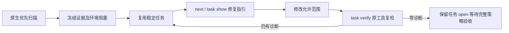

# Swift 原生优先修复工作台验收

对应 OpenSpec：introduce-rust-codeguard-cli，syntax-precheck 的 Swift native first observations join a stable repair task。S09、S11、S14 完整父任务仍开放。

实际证据：[swift-native-workbench-2026-10-05.json](evidence/swift-native-workbench-2026-10-05.json)，SHA256 `e70ac768fe574a4d79e99283c2e93221b54b5520451f8e676ab8f5d793bfe8fb`。基线 8f784a8，工作台接线为该基线之上的未提交改动；不能将基线视作已含本次实现。

Apple Swift 6.4 实际执行 init、首次检查、重复检查、next、保存 Hook、错误源码复检、修复后复检及 next，均复用同一任务。原始来源不伪造 grammar；零诊断记录 candidate_absent_unverified_policy，任务仍 open。没有实际安装宿主、可信关闭或完整 SwiftLint/类型/构建验收。

TDD 日志：首次 task_id 缺失 RED `/tmp/codeguard-swift-native-workbench-red.log`，工具自动发现 RED `/tmp/codeguard-swift-task-discovery-red.log`，对应 GREEN 与协议回归日志保存在同一 /tmp 前缀。仓库内可重跑 `cargo test -p codeguard-cli --features wasm-precheck --test swift_native_workbench`，以及开发环境 `python3 tests/swift_native_workbench_schema.py`（需 jsonschema、referencing）。两项集成行为覆盖重复任务、PATH 工具选择、已有任务修复后保留历史、新项目零诊断不建任务；四项协议测试覆盖真实报告、旧消费者拒绝、伪造来源及假通过拒绝。

原生首次简报 0.11 和复检简报 0.6 的来源引用不同，不放宽旧 schema。同步失败、缺工具、超时、源码/工具变化不得视为已修复。独立 lint 不接任务，项目级完整策略与公共发行保持未验收。

最终验证：受影响 WASM 八个目标合计 58 passed / 0 failed / 4 ignored；忽略项是显式原生条件测试，不计成功。默认 Swift 项目/保存/工作台目标 12 passed；默认及 WASM 全目标 Clippy -D warnings 通过。236 schema 元定义、229 历史 schema 字节不变、四项实际协议测试、fmt、分层、OpenSpec strict、九份文档的本地链接及 diff check 通过。

离线 npm 32 候选测试最初暴露 runner 工具继承；隔离 PATH 后第一轮 npm 缺 sh，补入 Node 与 /bin/sh 后实际安装包的全候选测试通过（1 passed，60.8 秒；其余两个包测试未重跑）。不修改原生优先策略，不将 32 份调用成功视作低误报资格。日志 `/tmp/codeguard-npm-all32-isolated.log`。
