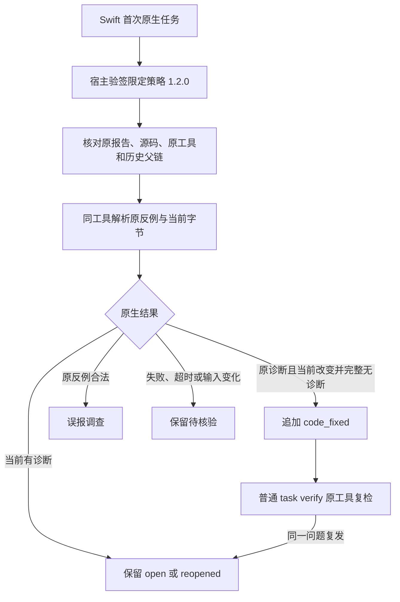

# Swift 限定语法任务关闭与复发验收

对应现有 OpenSpec `introduce-rust-codeguard-cli` 9.7、9.10、9.11、12.7、14.10/14.11。完整父任务保持未完成。本批只扩展共享生命周期处理器，不创建第二套关闭状态机。



`SwiftTaskResolutionRequest` 沿用共享输入契约；`verify_swift_task_resolution` 固定 `swift.parse.error` 和 Apple Swift 6.4。新策略 1.2.0、新证据 0.3.0；收据及父链事件沿用 0.1.0。原生首次 grammar=null，没有虚构 WASM 资产。旧 Zig/Erlang schema 不改写；读取证据时仍从首次任务核对语言，不能通过重算摘要替换原任务。

## TDD 与当前验证

API 缺失首先产生编译失败，见 `/tmp/codeguard-swift-resolution-red.log`。增加接口形状后，既有 Erlang 分流无法处理 Swift 策略，关闭测试因 `task_resolution_policy_scope_mismatch` 失败，见 `/tmp/codeguard-swift-resolution-behavior-red.log`；接通独立 Swift 检查器后同一测试通过。

受控工具测试覆盖：关闭、幂等、普通 CLI 复发重开、再次关闭、原反例合法需误报调查、不完整原生输出、替换工具、伪造 grammar、错误语言/版本、错误密钥、撤销、过期、缺时钟和回滚。无效签名/策略时原生调用日志不增加。夹具的 mode 文件仅用于验证编排，不能作为真实原生精度或完整环境身份验收。

默认受影响目标已通过 6 项、0 失败、1 忽略；两个 WASM 专属目标在默认构建下无测试，不计通过。真实 Swift 和 WASM 兼容回归的终态在完成后追加。不得把测试已编译或 ignored 记为实际原生执行。

## 复现

```bash
cargo test --locked --offline -p codeguard-cli --test swift_task_resolution_service
CODEGUARD_SWIFT_BIN=/absolute/path/to/swiftc cargo test --locked --offline \
  -p codeguard-cli --test swift_task_resolution_service \
  real_swift64_resolution_and_recurrence -- --ignored --exact
```

默认插件的可信策略提供者、实际安装宿主触发关闭、完整 SwiftLint/类型/项目构建、安全/依赖、原生工具完整供应链和跨平台仍缺。当前公开 npm 和插件锁未改变；限定任务 resolved 不签发项目 allow，历史本地查询继续要求核验。完整 OpenSpec 目标不因本切片完成而关闭。

## 真实原生输出

本机 `/usr/bin/swiftc` 返回 Apple Swift 6.4；显式测试原错误 `func f(_ x: ) {}`、修复 `func f(_ x: Int) {}`、再恢复原错误，实际关闭和复发各成功。宿主签名/公钥仍是测试夹具；不宣称默认插件的真实宿主审批已接通。真实测试 1 passed / 0 failed / 0 ignored，日志 `/tmp/codeguard-swift-resolution-real.log`。

[策略](evidence/swift64-native-resolution-2026-10-05-policy.json)、[对照证据](evidence/swift64-native-resolution-2026-10-05-evidence.json)、[收据](evidence/swift64-native-resolution-2026-10-05-receipt.json) 保存实际输出。证据绑定测试宿主制品、原生工具和本次私有工作区，公开文件本身不提供可重用的批准上下文。收据示例：

```json
{
  "authority": "host_context_verified",
  "delivery_decision": "not_evaluated",
  "event_ref": ".codeguard/findings/CG-B-49118a2bacd4f36544899d233c7a8be2/events/lifecycle-event-bae71e1f33391ec700991af082c622f4e1466f8069f3a9fed8bbecfe075d2ad8.json",
  "evidence_ref": ".codeguard/state/resolution_evidence/7a6761ae8dc7cda1455a104b83c6f43edd4bdb8a2b7974db7c36dca50d6fecf2.json",
  "evidence_sha256": "7a6761ae8dc7cda1455a104b83c6f43edd4bdb8a2b7974db7c36dca50d6fecf2",
  "identity": {
    "checker_id": "syntax.native_confirmation",
    "scope": "App.swift",
    "task_id": "CG-B-49118a2bacd4f36544899d233c7a8be2",
    "workspace_id": "ws-147a2750ff412c3c3ac43a9a1233db95"
  },
  "outcome": "code_fixed",
  "policy_revision": "p1",
  "policy_sha256": "d1651cbaa6ffe37bd9c1dbf86a312523fb3d08abee590bab9c5d1f0495ee7f99",
  "report_type": "task_resolution_receipt",
  "schema_version": "0.1.0",
  "state": "resolved"
}
```

4 项实际输出 schema/身份不变量及负例校验通过；239 份 schema 元定义有效，237 份历史 schema 原字节不变。分层检查、OpenSpec strict 和 diff 空白检查通过。共享服务 WASM 回归及严格 Clippy 终态随后追加，不能借用上一提交的 CI 证明本批修改。

共享服务六个 WASM 受影响目标终态：52 passed / 0 failed / 4 ignored（Erlang 9、Swift 工作台2、Swift 原复检7、新 Swift 生命周期4、租约21、Zig 9）。实际 Swift 的显式执行另1 passed，不把条件忽略算原生验收。未重跑完整默认测试，上一提交1288通过不作为本批全套结果；本批使用受影响回归和后续新提交CI核验。

最终默认与 WASM 的 workspace/all-targets Clippy `-D warnings` 均退出0，fmt、分层、OpenSpec strict、11个新增文档链接及diff空白校验通过。完整目标仍开放。日志摘要：

- `/tmp/codeguard-swift-resolution-behavior-red.log`：SHA-256 `07a42205b30a17435255e9faebd107077b94d1ccfe2066691c095d0daa10d1fa`。
- `/tmp/codeguard-swift-resolution-default.log`：SHA-256 `33408bcdcf09e155ce5dca4be7ef74a70fb284ac4db2a32df769937a2f86b101`。
- `/tmp/codeguard-swift-resolution-real.log`：SHA-256 `73b64708804eae2a5acd4016324060d3b0127eea7ad1ad5c934269fc98e5ead0`。
- `/tmp/codeguard-swift-resolution-wasm.log`：SHA-256 `ab65b886a3aeaee16b88dbbd142630db3ec94a1904ef2f4aed86f399dd03db4c`。
- `/tmp/codeguard-swift-resolution-clippy-default.log`：SHA-256 `26742bf0f7db4c76110fa2e7ac427faf1d7d3dcfdb1b53cf1fbbfce64de3201c`。
- `/tmp/codeguard-swift-resolution-clippy-wasm.log`：SHA-256 `c3eb63d6167db07e42cec9d93a117970b3dc3504274c5c505733d24358bb2416`。
