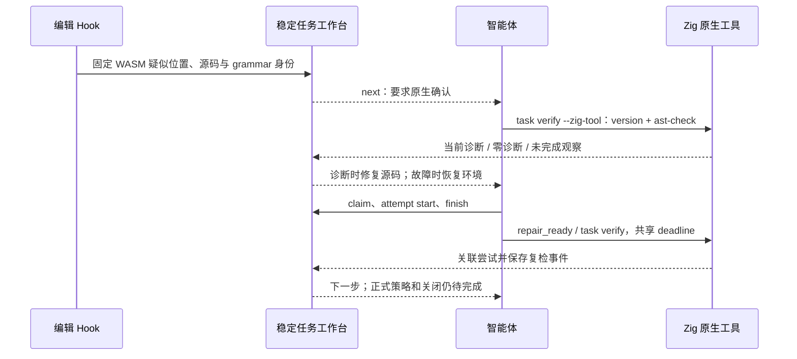

# WASM 确认任务接通原生 Zig 复检

日期：2026-10-04。对应既有 change S09/S11.17/S14.10–14.11；这些父任务保持未完成。



## 实现与边界

- `syntax.native_confirmation` 的 Zig 任务使用显式、普通、可读且摘要绑定的工具；只接受观察到的 Zig 0.16.0。原生通过不依赖 WASM 构建特性。AST 检查不是完整类型/lint/build/test 能力。
- 复检按任务已有源码范围启动；读者核对 workspace、原报告摘要、源码、grammar、工具和当前字节。只有同字节原生诊断可指导源码修复，变更后的旧观察不继续适用。
- `next` 0.3.0 的复检 argv 可复用摘要仍一致的 Zig 工具；`repair_ready` 接受该工具选项并进入同一 task verify 路径，保留租约与尝试记录。
- 缺工具/adapter、版本不支持、未识别原生错误均为未完成，保存到现有报告和事件；不把工具失败报成源码违规。其它通用语言尚缺原生 adapter。
- 原生零诊断保留 `candidate_absent_unverified_policy`，不关闭任务；正式规则/策略/覆盖及复发重开仍待完成。
- `syntax_task_recheck` 0.1.0 与 `task_verification_preview` 0.12.0 保持局部、未授予权威。旧简报/复检 schema 逐字节保留。

## 验证记录

协议替身、真实 WASM、真实 Zig、默认构建、CI 和已安装宿主分别报告，不互相替代。

- 目标行为的 RED：`/tmp/codeguard-zig-base-red.log` 中默认构建缺少原生 Zig 入口；`/tmp/codeguard-native-syntax-argv-red.log` 中 Hook 拒绝 Zig 选项且 next 缺工具 argv；`/tmp/codeguard-native-syntax-evidence-red.log` 中简报缺少原生定位引用。修复后对应行为通过。测试自身错参造成的失败不计为产品 RED。
- 九组相关特性测试：83 passed、0 failed、14 ignored，见 `/tmp/codeguard-native-syntax-final-all-related.log`。包括真实 WASM 任务创建、稳定归并、失败记录、原生诊断/零诊断、输入变化、环境/版本失败、attempt 关联、租约保留、无进展停止及 Hook 复检。替身不当作真实 Zig。
- 明确执行忽略的真实 Zig 0.16.0 对照：1 passed，见 `/tmp/codeguard-native-syntax-real-zig.log`。它只证明所列坏源码与修复后源码的原生 AST 路径，不证明系统性精度。
- 默认工作区全目标测试：1113 passed、0 failed、105 ignored、201 组，见 `/tmp/codeguard-native-syntax-workspace-final.log`。早先交叉构建覆盖公共测试二进制的运行失败不当作终态；最终采用顺序构建。
- 使用同一默认构建（grammar probe 拒绝未构建的 WASM）复检特性版生成的实际工作台，原生 Zig completed，event_persisted=true，仍为 candidate_absent_unverified_policy；见 `/tmp/codeguard-syntax-native-artifacts/default-build-verify.json`。
- grammar 资产反例测试 11/11；先加载内置缓存后，外部字节、许可证、ABI 或发行状态变化仍被验证器拒绝。缓存仅涉及编译内置不可变数据。
- 172 个 schema 元定义有效；实际缺工具/原生错误/原生零诊断及 next 通过封闭 schema，4 个权威/覆盖/原因伪造被拒绝；历史 0.2 简报与 0.11 复检 schema 逐字节等于前一提交。见 `/tmp/codeguard-native-syntax-schema-final.log`。
- 特性全目标 Clippy -D warnings、fmt、分层、OpenSpec strict 与 diff 检查通过；新提交 CI 需按其 SHA 另行核验。

真实安装的 Claude Code/Codex/Gemini 自动触发、其它通用语言原生确认、正式任务关闭/复发重开、政策与完整覆盖、跨平台和系统性误报/性能验收仍未完成。

## 实际下一步简报摘录

以下摘自本轮真实 Zig 对照输出；不是完整 schema，任务 ID 和原生报告属于临时验收工作区。

```json
{
  "schema_version": "0.3.0",
  "task_id": "CG-B-bed0acf0db2e55d06dd8dbfa4b8bbbc1",
  "action_id": "repair-source",
  "disposition": "actionable",
  "native_confirmation_status": "diagnostics_observed",
  "native_confirmation_ref": {
    "report_ref": ".codeguard/reports/syntax-native-72937-1791048042762841000.json",
    "report_sha256": "a1fbb7fe7c85831794eb227af2636b9e06a76eb1a1f6d56f1632fa58fd2cb1db",
    "run_id": "syntax-native-72937-1791048042762841000"
  },
  "native_diagnostic_positions": [
    {
      "column": 19,
      "line": 1,
      "rule_id": "zig.ast_check.error"
    }
  ],
  "recheck_argv": [
    "codeguard",
    "task",
    "verify",
    "CG-B-bed0acf0db2e55d06dd8dbfa4b8bbbc1",
    ".",
    "--format",
    "json",
    "--zig-tool",
    "/opt/homebrew/Cellar/zig/0.16.0_1/bin/zig"
  ]
}
```

报告引用和摘要使智能体可找到本轮原生依据；输入失效时 `native_diagnostic_positions` 为空，历史报告仍保留。
