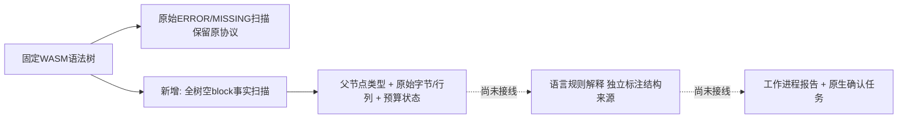

# WASM 空语句块结构事实（尚未接线）

对应 OpenSpec 14.4、14.17、14.19，父任务保持未完成。真实Ruff对照发现Python `empty_body`、`bad_indent`为语法无效，当前WASM没有恢复节点，见[原生对照](python-native-grammar-differential.md)。现有`scan_wasm_recoveries`按`has_error`裁剪分支，不提供grammar接受形状的结构事实。

Rust API `scan_wasm_empty_blocks(&tree, max_records)` 返回`WasmEmptyBlockScan`，每条`WasmEmptyBlock`保留直接父节点类型、原始字节及零基行/字节列。仅观察精确名为`block`的节点，忽略comment命名子节点；记录预算1–1024，栈和遍历节点预算200000。记录超限、遍历耗尽或栈预算耗尽均保留truncated，不能凭零事实证明完整。它不返回规则ID、严重度、语言裁决、合成ERROR/MISSING或关闭许可。

4个测试实际加载固定WASM：Python空函数体、错误缩进、仅注释函数体能形成事实；pass、ellipsis、docstring、真实语句、Unicode/CRLF、空文件和纯注释不误判为空suite。合法Rust `fn run() {}`仍产生空block事实且语法树无错误，直接证明不能把该事实全语言视为违规。记录溢出、非法预算及600000字节/120000条pass的全树遍历耗尽均保留不完整。

验证：原始grammar加载/恢复扫描及新增事实扫描三个目标共21通过、0失败；最后Rust合法空块正对照加入后，新增目标4通过。该API尚未接入私有worker、公开报告、统一检查和修复任务，因此现有Python两项漏检仍未修复；不改写历史回放、schema、grammar资产、资格或政策。后续必须以独立结构来源接线，不能将事实混入原始恢复数组制造“grammar已经修好”的证据。

默认/WASM workspace/all-targets严格Clippy、改动文件rustfmt、OpenSpec strict、分层及1543处本地文档链接检查通过。CI增加新增扫描目标；未重跑完整workspace suite、原生差分或公开包验收，历史证据按来源提交保留。
