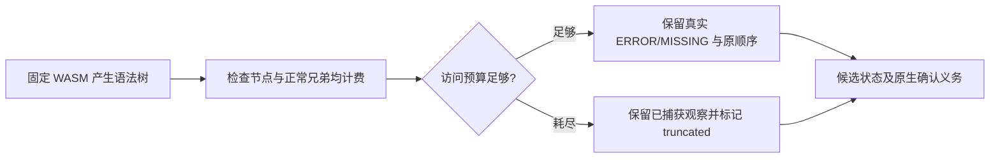

# WASM 恢复扫描的正常兄弟节点预算

日期：2026-10-06。对应 OpenSpec S03.2、S14.5 和 syntax-precheck 的有界执行契约。父任务仍未完成。

## 缺陷、修复与边界

此前 `scan_wasm_recoveries` 只在弹出错误分支时增加 visited。为了定位该分支，扫描器仍会按索引遍历父节点的全部子节点；正常兄弟未计费。真实 Java WASM 解析含 200010 个合法空声明和一个非法字段的源文件后，旧扫描器报告完整，实际访问超过声明预算。

目标回归先失败：`wide_error_branch_counts_normal_siblings_against_traversal_budget` 因 truncated=false 失败，日志 `/private/tmp/codeguard-wasm-sibling-budget-red.log`。修复不修改 grammar 字节、语法标签或恢复坐标，而是对节点弹出和每次子节点检查都计费，最多二十万次访问；逆向游标保持既有入栈顺序，避免反复按子节点索引查找。预算耗尽返回 truncated=true，不补造诊断。

新增 runtime 回归同时验证超预算宽树与正常规模非法源码；后者仍有真实恢复位置且扫描完整。新增隔离 worker 回归确认宽树的 truncated_files=1、状态 incomplete 和 grammar_qualified=false。Kotlin/Swift 的隐藏缺失 token 仍保持未完成，不通过字符串或 S-expression 猜测位置。

此处只修复恢复节点扫描的预算计量；其它结构扫描、平台资源隔离、grammar 误报/漏报、暖启动及整体语言资格仍须分别验收。Erlang 十例终止符漏检和 VB.NET 未缩进方法误报没有被该修复解决；上一版本 358 例历史报告保持原有程序身份。

## 本轮验证

验证终态追加于下；只统计实际运行目标，不合并默认忽略的原生工具测试。

- 运行时四个目标：26 passed / 0 failed / 0 ignored，含32份grammar加载正反例及隐藏错误回归。
- CLI五个目标：39 passed / 0 failed / 4 ignored，含真实隔离worker宽树回归、候选协议、Kotlin/Swift固定语料；忽略项为完整回放与显式原生工具对照，不计通过。
- 两个受影响crate的WASM全目标Clippy -D warnings、OpenSpec strict、crate分层、所改文件rustfmt和git diff --check通过。
- grammar字节、协议版本和未提交Erlang草稿未变；未进行npm发布或完整跨平台验收。

日志字节身份：

- `/private/tmp/codeguard-wasm-sibling-budget-red.log`：SHA-256 `124878e88e9b8049f849f0164200b5b09a1e6f007b93295ec214b4540954f3e7`。
- `/private/tmp/codeguard-wasm-sibling-budget-green.log`：SHA-256 `90ceea0227384e69aa1e5bff25a8bd134fd42e2f88ace1bcb68abfa45627e3c9`。
- `/private/tmp/codeguard-wasm-sibling-budget-cli.log`：SHA-256 `3f5c324b64d3bcee4b1b00ccb79c95a70ac7bdbc237c61447dfca544d5fab84c`。
- `/private/tmp/codeguard-wasm-sibling-budget-clippy.log`：SHA-256 `59c6cfb93c602b2aed6138404f78860c8f1457a44b06ab38588b080ab917e8ba`。
