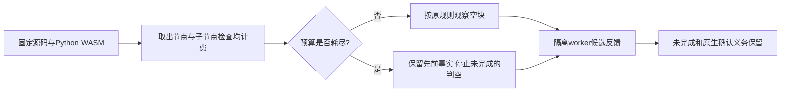

# WASM 结构扫描的子节点访问预算

日期：2026-10-06。对应 OpenSpec S03.2 / S14.5，沿用同一 syntax-precheck 规格，不调整关闭权限或语言资格；父任务保持未完成。

## 缺陷与行为

恢复扫描预算修复后，检查空语句块扫描发现同类问题：visited 只统计出栈节点，枚举子节点及判空时检查命名子节点没有计费。真实 Python WASM 对六万条 pass 的语法树执行结构扫描，旧实现将超过二十万次的实际节点访问报告为完整。新增目标先因 truncated=false 失败，见 RED 日志。

现将节点取出、普通子节点检查和判空命名子节点检查统一计入二十万次访问预算；命名子节点和逆向 DFS 子节点均使用游标遍历，保留原顺序。判空检查途中耗尽预算不能生成该块为空的事实；其它块已有观察保留。超限不是源码违规或原生通过。

runtime 回归覆盖无空块宽树和先发现空块后超预算的宽树；前者零事实但未完成，后者保留一项事实但仍未完成。CLI 隔离worker回归核对 truncated_files=1、既有 codeguard.python.required_suite 观察仍在、grammar_qualified=false。正常规模合法suite、注释、docstring、Unicode/CRLF、其它语言的合法空块、恢复位置和隐藏错误回归均保留。

## 实际验证

运行时 wasm_empty_block_scan / wasm_recovery_scan / wasm_root_child_scan：15 passed / 0 failed / 0 ignored。CLI syntax_worker_candidate / python_structural_syntax / check_python_structure：23 passed / 0 failed / 0 ignored。合计38项，实际在本机执行；不冒充全工作区、跨平台、原生工具或独立精度验收。

未修改grammar、规则包、报告协议或已发布npm制品。Erlang/VB.NET grammar差异仍未修复；普通任务自动关闭契约调整与生成器安装授权仍待确认。静态验证终态和日志身份追加于下。

受影响runtime/CLI两crate的WASM全目标Clippy -D warnings、OpenSpec strict、crate分层、所改文件rustfmt和git diff --check均通过。未执行或改动已有Erlang草稿；该文件SHA-256保持2e3a296072e6a3aa34b561799c18c7d8b621d00f8786301d2612cee8cdab85b6。

日志字节身份：

- `/private/tmp/codeguard-empty-block-budget-red.log`：SHA-256 `37e50229e15325c4a68c4975d25cdeb2281c7e16dcdd2744fc1c9df7449f9603`。
- `/private/tmp/codeguard-empty-block-budget-green.log`：SHA-256 `90f908e78913ef303ee8558472fce95511500e45f8ea9f649de3b69bd8269cc5`。
- `/private/tmp/codeguard-empty-block-budget-cli.log`：SHA-256 `ef3ea4ecd214d6c6afff82700c4f741324834251e4895e36ac5bd32b414c812b`。
- `/private/tmp/codeguard-empty-block-budget-clippy.log`：SHA-256 `1971c1b34116793c3486b0c893cfab9f850b693bae1dc7d50f8de7fe5651a338`。
