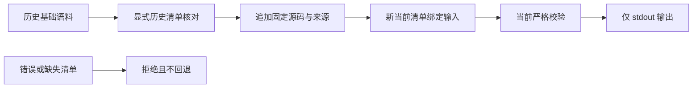

# 全工作区回归与开发语料导入身份修复

日期：2026-10-05；对应现有 OpenSpec 12.11、14.17、14.19 的局部验收，父任务保持开放。

## 全工作区 RED

源提交 `9e13df5eb708c0ca2cb6862b92b7b535749a80f2` 默认全工作区 `cargo test --locked --workspace --all-targets` 在 `build_grammar_corpus` 示例测试停止：历史输入被当前清单校验正确拒绝 `grammar_evaluation_corpus_identity_invalid`。此前目标回归没有执行此示例。原始日志 `/private/tmp/codeguard-default-suite-red-2026-10-05.log` SHA-256 `ccd3429810b52870244a026d15700a7f1e68513d4f2ce2b77c4db36f4c35d8b3`，失败后尚未执行的 core/runtime 目标不能算通过。

## 修复

Rust 开发导入器添加显式 `--base-manifest HISTORICAL_MANIFEST_JSON` 参数。默认输入仍需当前身份；历史分支有界读取给定清单并核对原输入摘要，生成只写 stdout 的当前绑定新输入，追加现有固定样本后再次通过当前生产校验。不能自动猜测历史身份、覆盖历史文件或授予原生 oracle/门禁批准。

示例回归三项通过：全部历史样本、源码和来源保持不变，仅输出清单身份变化；默认旧输入及错误显式清单拒绝；缺显式清单拒绝且不回退。双语 grammar 文档更新实际可用命令，删除错误的历史文件字节 cmp。生产验证器与历史证据不变。

## 验收边界

当前工作树有受保护 Erlang 扩展草稿；本轮不修改、不提交。默认构建的该 WASM 差分目标没有执行测试，不能替代其已知 RED。默认全工作区与显式本机原生目标分别记录结果，不以控制替身或默认测试中的 ignored 声称真实工具完成；完整远端 CI 和语言精度仍须独立核对。

这条开发期路径不启动解析 worker 或原生工具；历史核对不能直接授权当前回放。

## 默认全工作区终态

修复后重跑同一完整命令，退出0：1,357通过、0失败、123忽略，共244条目标结果记录（含默认构建未启用的零测试目标）。包含四个crate及全部example，不把零测试或忽略项计为验收。原始绿色日志 `/private/tmp/codeguard-default-suite-green-2026-10-05.log` SHA-256 `8a66b6356955a2e3d4471b2ea56df9c958679828c673f216e64c80de62c236da`；[摘要](evidence/default-workspace-regression-2026-10-05.json)明确绑定基线提交、实际导入器源码摘要、受保护Erlang草稿与默认feature范围。

另显式运行本机 Ruff0.16.8 的三个聚合原生目标（D100/D101注释与F401局部发现保留），3通过、0忽略，32.92秒；本机 JDK21 的 `real_jdk_check_java_reports_javadoc_comment_probe` 1通过、0忽略，2.04秒。它们补充局部原生证据，不把默认123个忽略项整体转为通过。

文档中的真实 `cargo run --example build_grammar_corpus` 命令已退出0，生成358例当前输入，全部cases与历史逐项相同，当前清单摘要a992c0975b49dc6ee811888be599a819deb5d106b762722417cfefec4d84c76e。输出 `/private/tmp/codeguard-importer-current-2026-10-05.json` SHA-256 `c6531058ceb2cbe5534d580ae973313a506681c077f4853ba956a5faccc8aa8a`，通过Draft202012语料schema。

## 远端定位

[Linux CI 37262493892](https://github.com/full-stack-plugins/codeguard/actions/runs/37262493892) 已完成并失败；实际步骤证明 WASM资源边界、全部grammar回放及本地npm包worker检查通过，失败在默认全工作区的同一个导入器例子。此记录适用348c9b8旧提交，不冒充本轮完整远端通过；当前修复需新提交CI终态。

WASM构建补充：grammar_evaluation 14通过/2显式全量回放忽略，64.19秒；build_grammar_corpus 3通过，0.07秒。旧语料不能启动当前worker、取消/超时保留未知分母、历史身份及完整样本来源均保持原契约。本轮未重跑358例worker，远端旧提交的回放通过不能作为本轮语言质量验收。

默认/WASM全目标严格Clippy、定向rustfmt、OpenSpec strict、crate layering及diff检查通过。历史清单/语料/WASM身份原字节不变，受保护Erlang草稿未编辑或纳入提交。
