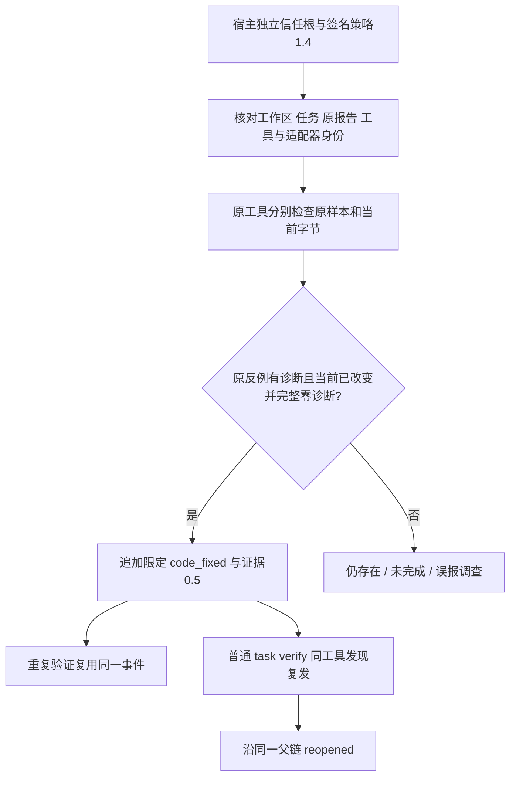

# Zig 原生首次限定任务关闭与复发验收

OpenSpec introduce-rust-codeguard-cli / remediation-workflow、syntax-precheck。14.10/14.11/14.14/14.19 仍含跨语言、默认宿主和发行缺口，不勾选父任务。

`verify_zig_task_resolution` 复用签名、冻结源码、共享截止时间、租约和追加式父链。新策略1.4.0只接受 Zig 原生首次事实0.6.0及 `grammar_sha256=null`；旧 WASM 来源策略1.0.0与证据0.1.0保持原契约。新证据0.5.0不伪造 grammar 摘要，内部规则绑定使用实际批准策略摘要。



验收测试 `zig_native_first_resolution`：

- 关闭、重复验证幂等、普通 CLI 复检重开及再次修复关闭。
- 旧策略、跨语言规则/版本、伪造 grammar、错误密钥、撤销、失去可信时钟、过期及回滚在原生执行前拒绝。
- 原反例合法要求误报调查；未完成原生输出不关闭；查询指引不改变工具调用、事件或租约。
- 工具变化无法关闭原任务；重签新工具也不能覆盖首次工具身份。

另有 `zig_native_cli` 反例实测：退出0但异常 stdout、越界行和越界字节列保留 incomplete 并撤回位置。修复前该 stdout 反例被误报为 completed，测试确实暴露了假通过。

实际已有工具命令：

```bash
CODEGUARD_ZIG_BIN=/opt/homebrew/bin/zig cargo test --locked --offline -p codeguard-cli --test zig_native_first_resolution real_zig016_resolution_and_recurrence -- --ignored
```

结果1通过、0失败，57.10秒。宿主 Ed25519 密钥和时钟是签名夹具，不代表真实默认宿主已获批准。真实工具报告：[策略](evidence/zig016-native-first-resolution-2026-10-05-policy.json)、[证据](evidence/zig016-native-first-resolution-2026-10-05-evidence.json)、[收据](evidence/zig016-native-first-resolution-2026-10-05-receipt.json)。

收据中的 `state=resolved` 仅指这一项语法任务；`delivery_decision=not_evaluated`，不能推导完整项目 lint、build、CVE 或入库门禁通过。默认插件可信提供者、完整项目/语言/平台与公开发行仍未完成。Python schema 验证只用于开发验收，不参与产品检查。

验证汇总：默认受控目标6通过/0失败/1忽略；实际 Zig测试另行1通过；WASM 构建11个受影响目标61通过/0失败/9忽略，覆盖旧 Zig、Erlang、Swift、Kotlin 关闭与普通复检。新 SDK schema辅助2通过，首次原生跨入口schema辅助1通过；260份 schema 元协议有效，258份历史 schema 字节保持不变。默认/WASM workspace all-targets Clippy、改动文件 rustfmt、OpenSpec strict、分层与686处本地文档链接检查通过。未执行完整 workspace 测试及全部平台验收。
