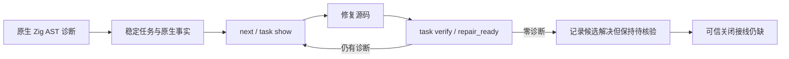

# Zig 首次原生任务局部验收

对应 OpenSpec introduce-rust-codeguard-cli：remediation-workflow / syntax-precheck，14.10、14.11、14.14、14.19 保持未完成。

原生首次观察不依赖 WASM 初检。初始化工作区后，单文件 lint、check all/check zig 和已确认编辑按同一源码范围同步稳定任务。重复扫描复用 ID；新文件完整零诊断不创建任务；复检失败/零诊断写入历史，未核验可信政策不关闭。



当前协议版本：observation0.6、绑定scan0.2、check0.47、lint0.3、brief0.12、task-show0.2、recheck0.8/preview0.19、编辑Hook0.16、复检Hook0.15。历史 schema 不改写。原生首次 `grammar_sha256=null`，不虚构 grammar 缺陷。

受控测试 `zig_native_workbench` 验证跨入口稳定身份、原工具复检参数、完整零诊断不创建任务与事件持久化。开发辅助 `tests/zig_native_first_feedback_schema.py` 对实际 CLI 输出验证全部新增协议，反例拒绝伪造 allow。Python 辅助不参与产品运行时。

实际已有 Zig 0.16.0 执行：

```bash
CODEGUARD_ZIG_BIN=/opt/homebrew/bin/zig cargo test --locked --offline -p codeguard-cli --test zig_native_workbench real_zig_first_native_task_rechecks_bad_and_fixed_input -- --ignored
```

本机结果1通过、0失败，64.62秒；[真实原生报告](evidence/zig-native-first-2026-10-05.json) 包含首次扫描、next、错误和修复后复检，以及最终 open 状态。所用工具由显式路径选择，没有安装工具。

范围限制：原生首次 Zig 任务现有[独立可信 SDK 关闭接口](zig-native-first-resolution.md)，默认提供者仍未接入；已有 WASM 来源 Zig 关闭协议不因此扩权。完整 lint、build、所有语言精度、真实默认安装宿主和发行未验收。公开 npm0.1.4 与插件锁未更新。

回归结果：WASM 构建的9个受影响测试目标合计66通过、0失败、5忽略；实际 Zig 上述1项单独通过。最终默认构建 Zig 三个目标13通过、0失败、2忽略。默认与 WASM workspace/all-targets Clippy `-D warnings` 均通过；OpenSpec strict、分层检查和改动文件格式检查通过。258个 schema 元协议与实际 Zig 报告通过，248份历史 schema 字节保持不变。此记录不代表全 workspace 测试或所有平台完成验收。
